### F020 入职登记
### 5.3.5 RS020101 登录移动端

| **属性** | **内容** |
| --- | --- |
| 编号 | RS020101 |
| 名称/标识符 | 登录移动端 |
| 补充说明 | 员工点击链接，通过"手机号 + 验证码"一键登录； 入职登记阶段，在移动端填写信息过程中，入职工单系统只存入数据。 需要先根据手机号查询入职工单接口，只有存在数据并且状态不是‘入职终止’才能进行登录。只有状态是‘入职登记’才能进行页面字段编辑，否则就只读。 |

**数据项描述**：

| **数据项名称** | **数据类型** | **数据长度** | **是否必填** | **数据来源** | **备注说明** |
| --- | --- | --- | --- | --- | --- |
| 手机号码 | 文本 | 11 | 是 | 用户输入 | 用于验证码发送和身份识别 |
| 验证码 | 文本 | 6 | 是 | 系统随机生成6位的数字，并保存到redis中，通过短信 API发送给登录人员用于登录 | 有效期 5 分钟 |
| 工单状态 | 枚举 | — | 是 | 入职工单 API | 判断员工需进入的页面的条件 |
| 验证状态 | 枚举 | — | 否 | 手机号登录 | 手机号验证成功后，工单记录 |

### 5.3.6 RS020102 签订隐私声明

| **属性** | **内容** |
| --- | --- |
| 编号 | RS020102 |
| 名称/标识符 | 签订隐私声明 |
| 功能描述 | 调用 DPO 隐私协议服务，展示隐私协议内容，员工签署后记录确认状态 |
| 补充说明 | 未确认隐私声明的员工，不允许进入后续资料填写环节 |

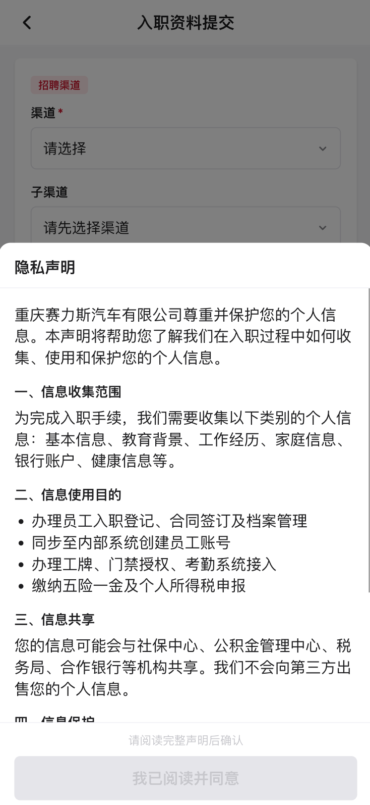

**数据项描述**：

| **数据项名称** | **数据类型** | **数据长度** | **是否必填** | **数据来源** | **备注说明** |
| --- | --- | --- | --- | --- | --- |
| 隐私声明内容 | HTML | — | 是 | DPO 服务 | 由 DPO 系统提供网页并管理。对方会提供一个接口给我们。 |
| 确认状态 | 布尔 | — | 是 | 员工操作 | 已确认/未确认 |
| 确认时间 | 时间戳 | — | 是 | 系统生成 |  |
| 隐私声明确认 | 列表 | - | 是 | 工单系统 | 设置 完成 |

隐私声明确认之后，需要更新相关信息到工单系统。
（在需求分析的时候，麻烦你先分析一下哪些字段应该是动态的展示，和更新）。

### 5.3.7 RS020103 入职指引查阅

| **属性** | **内容** |
| --- | --- |
| 编号 | RS020103 |
| 名称/标识符 | 入职指引查阅 |
| 功能描述 | 展示入职指引信息，包括入职流程说明、所需材料清单、注意事项等，帮助员工了解入职流程 |
| 补充说明 | 入职指引内容根据基地和用工形式动态展示，确保信息的准确性和针对性。 对方会提供一个接口给我们。 |

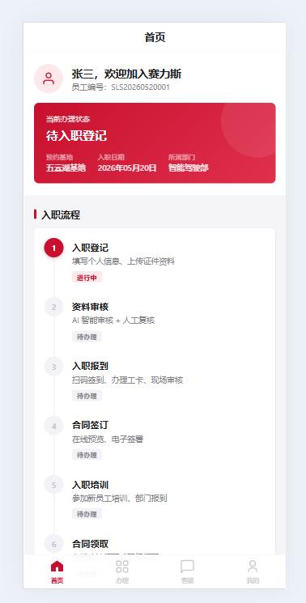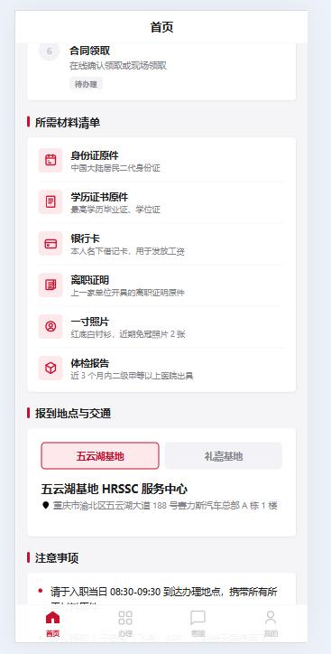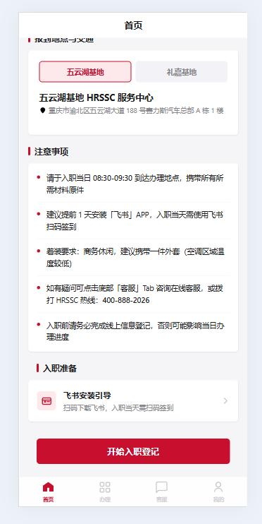

**数据项描述**：

| **数据项名称** | **数据类型** | **数据长度** | **是否必填** | **数据来源** | **备注说明** |
| --- | --- | --- | --- | --- | --- |
| 报到地点与交通 | 富文本 | — | 是 | 配置表取得 | 报道地点动态匹配 |
| 阅读确认状态 | 布尔 | — | 否 | 员工操作 | 已阅读/未阅读 |
| 阅读时间 | 时间戳 | — | 否 | 系统生成 |  |
| 入职指引查阅 | 列表 | - | 否 |  | 设置 完成 |

进入该页面后，需更新工单系统中的入职指引相关字段。
页面实现参考这个html（"F:\Jay\h5-app\guide.html"），里面字段都应该从后端接口中获取。
（在需求分析的时候，麻烦你先分析一下哪些字段应该是动态的展示，和更新）。

### 5.3.8 RS020104 提交入职资料

| **属性** | **内容** |
| --- | --- |
| 编号 | RS020104 |
| 名称/标识符 | 提交入职资料 |
| 功能描述 | 员工根据页面提示，填写个人信息并上传相关证明材料（支持录入/暂存/提交三种模式） |
| 补充说明 | 13 个信息类型、若干上传附件、122 个业务字段校验规则 |

校验规则，增加附件

  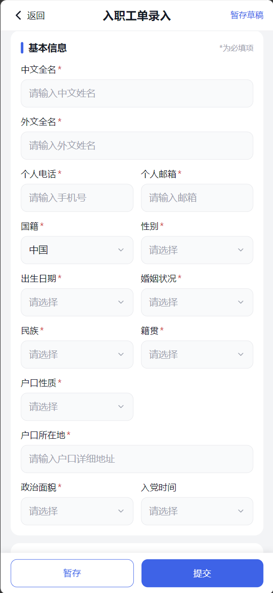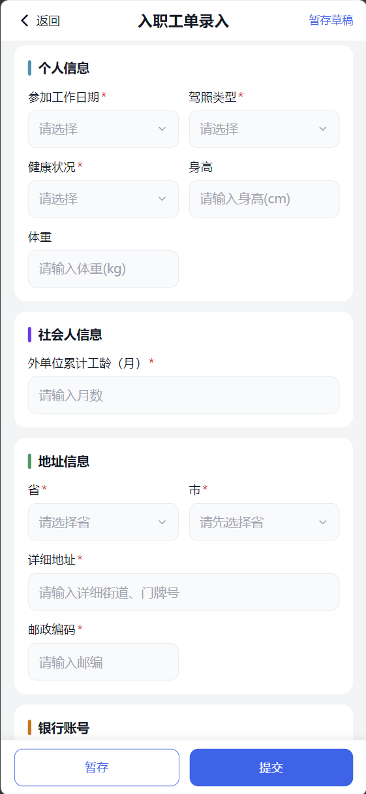
  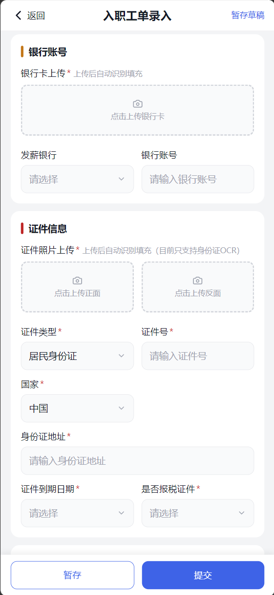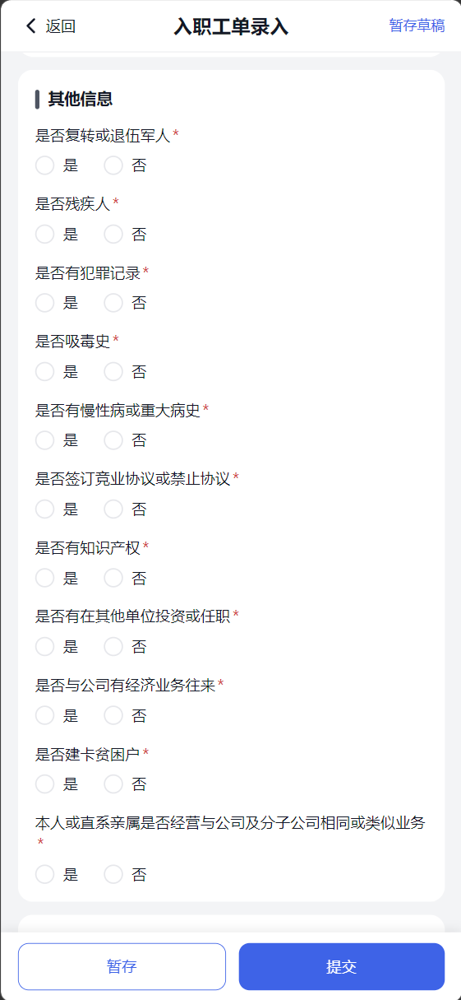
**数据项描述****:**
**入职工单**：

| 序号 | 大类 | 名称 | 系统类型 | 必填项目 | API 字段名 |
| --- | --- | --- | --- | --- | --- |
| 1 | 基本信息 | 中文全名 | 单行文本 | 必填 | chineseName |
| 2 | 基本信息 | 外文全名 | 单行文本 | 必填 | foreignName |
| 3 | 基本信息 | 个人电话 | 电话 | 必填 | personalPhone |
| 4 | 基本信息 | 个人邮箱 | 邮箱 | 必填 | personalEmail |
| 5 | 基本信息 | 国籍 | 单选 | 必填 | nationality |
| 6 | 基本信息 | 性别 | 单选 | 必填 | gender |
| 7 | 基本信息 | 出生日期 | 日期 | 必填 | birthDate |
| 8 | 基本信息 | 婚姻状况 | 单选 | 必填 | maritalStatus |
| 9 | 基本信息 | 结婚日期 | 日期 | 非必填 | marryDate |
| 10 | 基本信息 | 民族 | 单选 | 必填 | nation |
| 11 | 基本信息 | 籍贯 | 单选 | 必填 | nativePlace |
| 12 | 基本信息 | 户口性质 | 单选 | 必填 | householdType |
| 13 | 基本信息 | 户口所在地 | 单选 | 必填 | householdAddress |
| 14 | 基本信息 | 政治面貌 | 单选 | 必填 | politicalStatus |
| 15 | 基本信息 | 入党时间 | 日期 | 非必填 | partyJoinDate |
| 16 | 个人信息 | 参加工作日期 | 日期 | 必填 | workStartDate |
| 17 | 个人信息 | 驾照类型 | 单选 | 必填 | drivingLicenseType |
| 18 | 个人信息 | 健康状况 | 单选 | 必填 | healthStatus |
| 19 | 个人信息 | 不健康说明 | 单行文本 | 非必填 | unhealthyExplain |
| 20 | 个人信息 | 身高 | 数字 | 非必填 | height |
| 21 | 个人信息 | 体重 | 数字 | 非必填 | weight |
| 22 | 地址信息 | 家庭地址 | 单行文本 | 必填 | homeAddress |
| 23 | 地址信息 | 邮政编码 | 数字 | 必填 | postalCode |
| 24 | 银行账号 | 银行账号 | 数字 | 非必填 | bankAccount |
| 25 | 银行账号 | 发薪银行 | 单选 | 非必填 | salaryBank |
| 26 | 社会人信息 | 外单位累计工龄（月） | 数字 | 必填 | outerWorkAgeMonth |
| 27 | 其他信息 | 是否复转或退伍军人 | 单选 | 必填 | isVeteran |
| 28 | 其他信息 | 是否残疾人 | 单选 | 必填 | isDisabled |
| 29 | 其他信息 | 是否有犯罪记录 | 单选 | 必填 | isCriminalRecord |
| 30 | 其他信息 | 是否吸毒史 | 单选 | 必填 | isDrugHistory |
| 31 | 其他信息 | 是否有慢性病或重大病史 | 单选 | 必填 | isSeriousDisease |
| 32 | 其他信息 | 是否签订竞业协议或禁止协议 | 单选 | 必填 | isCompeteAgreement |
| 33 | 其他信息 | 是否有知识产权 | 单选 | 必填 | isIntellectualProperty |
| 34 | 其他信息 | 是否有在其他单位投资或任职 | 单选 | 必填 | isOtherInvestJob |
| 35 | 其他信息 | 是否与公司有经济业务往来 | 单选 | 必填 | isCompanyBusiness |
| 36 | 其他信息 | 是否建卡贫困户 | 单选 | 必填 | isPoorHousehold |
| 37 | 其他信息 | 本人或直系亲属是否经营与公司及分子公司相同或类似业务 | 单选 | 必填 | isRelativeSameBusiness |

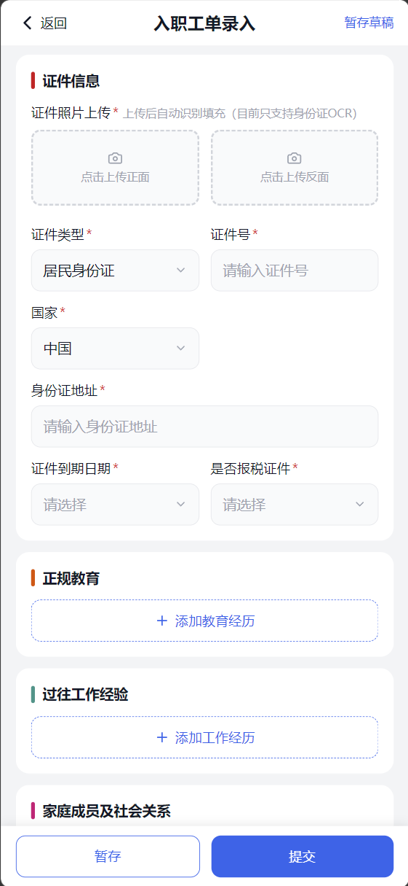
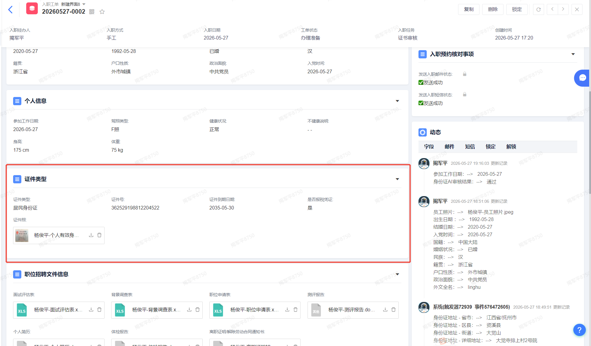
**证件信息****：**

| 序号 | 大类 | 名称 | 系统类型 | 必填项目 | API 字段名 |
| --- | --- | --- | --- | --- | --- |
| 1 | 社会人信息 | 证件号 | 单行文本 | 必填 | certificateNo |
| 2 | 社会人信息 | 国家 | 单选 | 必填 | country |
| 3 | 社会人信息 | 证件类型 | 单选 | 必填 | certificateType |
| 4 | 社会人信息 | 证件到期日期 | 日期 | 必填 | certificateExpireDate |
| 5 | 社会人信息 | 身份证地址 | 单行文本 | 必填 | idCardAddress |
| 6 | 社会人信息 | 是否报税证件（单选） | 单选 | 必填 | isTaxCertificate |

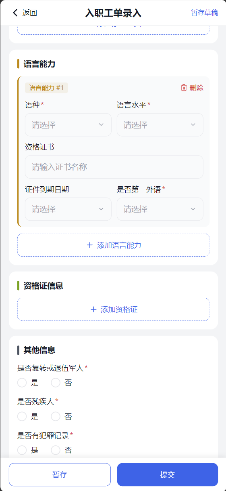

**语言能力：**

| 序号 | 大类 | 名称 | 系统类型 | 必填项目 | API 字段名 |
| --- | --- | --- | --- | --- | --- |
| 1 | 社会人信息 | 语种 | 单选 | 必填 | languageType |
| 2 | 社会人信息 | 语言水平 | 单选 | 必填 | languageLevel |
| 3 | 社会人信息 | 获得的资格证书 | 单行文本 | 非必填 | languageCert |
| 4 | 社会人信息 | 证件到期日期 | 日期 | 非必填 | languageCertExpire |
| 5 | 社会人信息 | 是否第一外语 | 单选 | 必填 | isFirstLanguage |

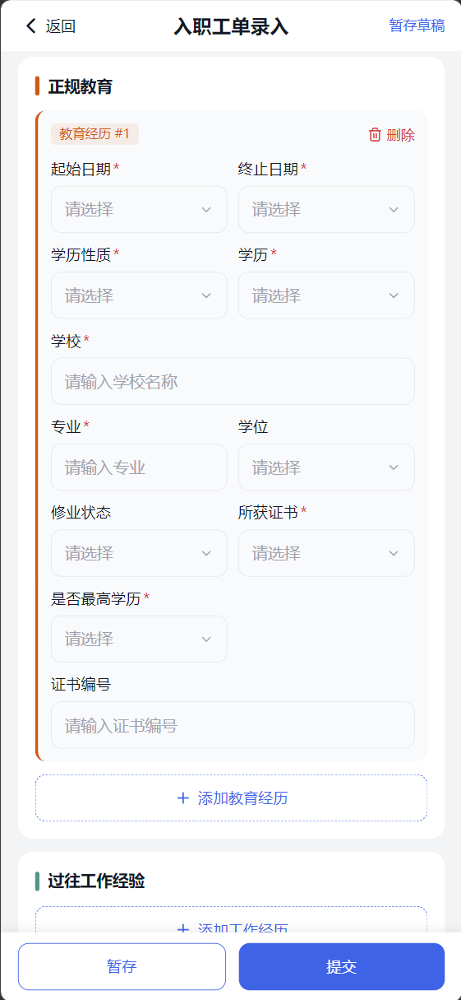
**正规教育：**

| 序号 | 大类 | 名称 | 系统类型 | 必填项目 | API 字段名 |
| --- | --- | --- | --- | --- | --- |
| 1 | 社会人信息 | 起始日期 | 日期 | 必填 | eduStartDate |
| 2 | 社会人信息 | 终止日期 | 日期 | 必填 | eduEndDate |
| 3 | 社会人信息 | 学历性质 | 单选 | 必填 | eduNature |
| 4 | 社会人信息 | 学历 | 单选 | 必填 | education |
| 5 | 社会人信息 | 学校 | 单行文本 | 必填 | schoolName |
| 6 | 社会人信息 | 专业 | 单行文本 | 必填 | major |
| 7 | 社会人信息 | 证书编号 | 单行文本 | 非必填 | eduCertNo |
| 8 | 社会人信息 | 学位 | 单选 | 非必填 | degree |
| 9 | 社会人信息 | 修业状态 | 单选 | 非必填 | studyStatus |
| 10 | 社会人信息 | 所获证书 | 单选 | 必填 | getCertificate |
| 11 | 社会人信息 | 是否最高学历 | 单选 | 必填 | isHighestEdu |

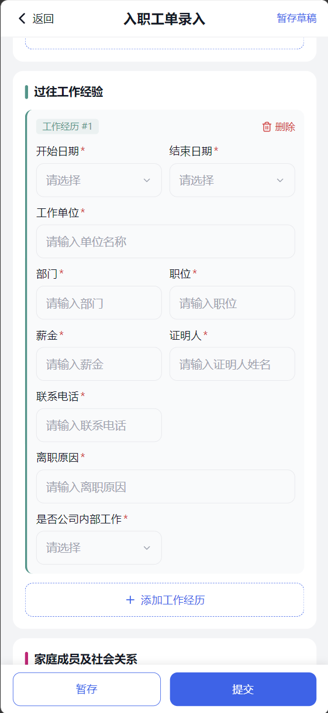

**过往工作经历：**

| 序号 | 大类 | 名称 | 系统类型 | 必填项目 | API 字段名 |
| --- | --- | --- | --- | --- | --- |
| 1 | 社会人信息 | 开始日期 | 日期 | 必填 | workExpStartDate |
| 2 | 社会人信息 | 结束日期 | 日期 | 必填 | workExpEndDate |
| 3 | 社会人信息 | 工作单位 | 文本 | 必填 | workCompany |
| 4 | 社会人信息 | 部门 | 文本 | 必填 | workDept |
| 5 | 社会人信息 | 职位 | 文本 | 必填 | workPost |
| 6 | 社会人信息 | 薪金 | 文本 | 必填 | workSalary |
| 7 | 社会人信息 | 证明人 | 文本 | 必填 | witnessName |
| 8 | 社会人信息 | 联系电话 | 文本 | 必填 | witnessPhone |
| 9 | 社会人信息 | 离职原因 | 文本 | 必填 | resignReason |
| 10 | 社会人信息 | 是否公司内部工作 | 单选 | 必填 | isInnerWork |

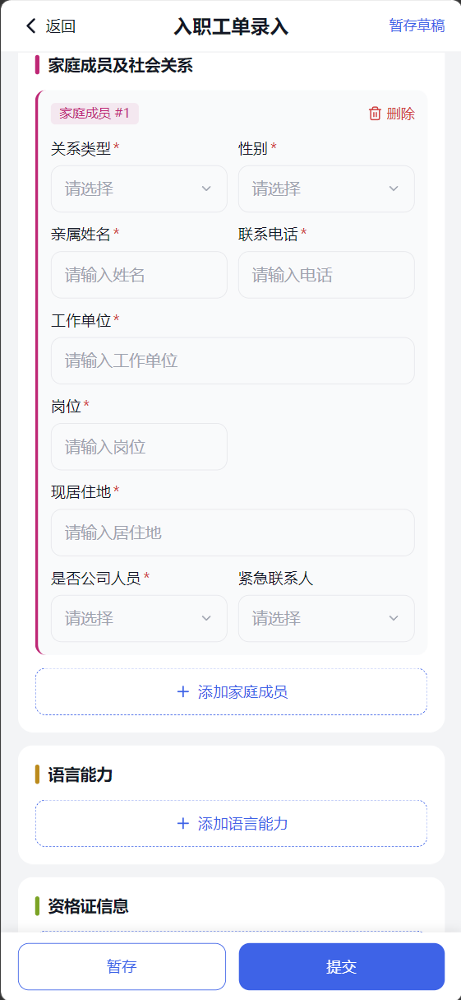

**家庭成员及社会关系：**

| 序号 | 大类 | 名称 | 系统类型 | 必填项目 | API 字段名 |
| --- | --- | --- | --- | --- | --- |
| 1 | 社会人信息 | 关系类型 | 单选 | 必填 | relationType |
| 2 | 社会人信息 | 性别 | 列表 | 必填 | familyGender |
| 3 | 社会人信息 | 亲属姓名 | 单行文本 | 必填 | familyName |
| 4 | 社会人信息 | 家庭成员及社会关系-联系电话 | 单行文本 | 必填 | familyPhone |
| 5 | 社会人信息 | 家庭成员及社会关系-工作单位 | 单行文本 | 必填 | familyCompany |
| 6 | 社会人信息 | 家庭成员及社会关系-岗位 | 单行文本 | 必填 | familyPost |
| 7 | 社会人信息 | 现居住地 | 单行文本 | 必填 | familyAddress |
| 8 | 社会人信息 | 备注 | 多行文本 | 非必填 | familyRemark |
| 9 | 社会人信息 | 是否公司人员 | 单选 | 必填 | isCompanyStaff |
| 10 | 社会人信息 | 紧急联系人标识 | 单选 | 非必填 | isEmergencyContact |

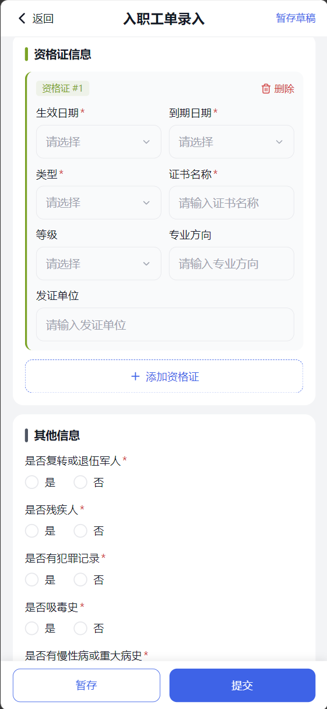

**资格证信息：**

| 序号 | 大类 | 名称 | 系统类型 | 必填项目 | API 字段名 |
| --- | --- | --- | --- | --- | --- |
| 1 | 社会人信息 | 生效日期 | 日期 | 必填 | certEffectDate |
| 2 | 社会人信息 | 到期日期 | 日期 | 必填 | certExpireDate |
| 3 | 社会人信息 | 类型 | 单选 | 必填 | certType |
| 4 | 社会人信息 | 证书名称 | 单行文本 | 必填 | certName |
| 5 | 社会人信息 | 等级 | 单选 | 非必填 | certLevel |
| 6 | 社会人信息 | 专业方向 | 单行文本 | 非必填 | certMajor |
| 7 | 社会人信息 | 发证单位 | 单行文本 | 非必填 | certIssueOrg |

**工作许可证及签证信息：**

| 序号 | 大类 | 名称 | 系统类型 | 必填项目 | API 字段名 |
| --- | --- | --- | --- | --- | --- |
| 1 | 社会人信息 | 颁布日期 | 日期 | 必填 | visaIssueDate |
| 2 | 社会人信息 | 工作许可及签证信息-证件到期日期 | 日期 | 必填 | visaExpireDate |
| 3 | 社会人信息 | 工作许可及签证信息-证件类型 | 列表 | 必填 | visaType |
| 4 | 社会人信息 | 工作许可及签证信息-证件号 | 单行文本 | 必填 | visaNo |

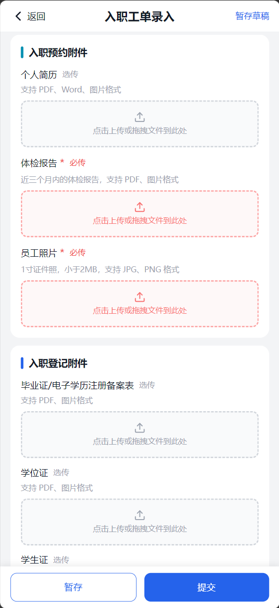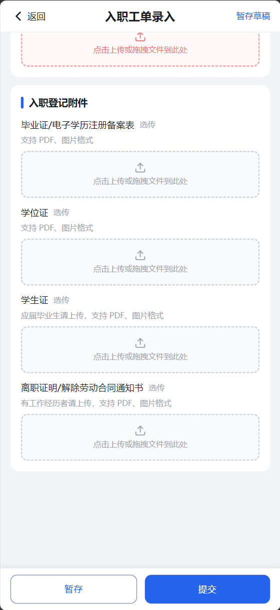

附件清单：

| 序号 | 对应流程 | 附件名称 | 上传规则 |
| --- | --- | --- | --- |
| 1 | 入职预约 | 个人简历 | 选传 |
| 2 | 入职预约 | 体检报告 | 必传 |
| 3 | 入职预约 | 员工照片 | 必传，1寸照，小于2M |
| 4 | 入职登记 | 个人有效身份证（正面） | 必传 |
| 5 | 入职登记 | 个人有效身份证（背面） | 必传 |
| 6 | 入职登记 | 毕业证/电子学历注册备案表 | 选传 |
| 7 | 入职登记 | 学位证 | 选传 |
| 8 | 入职登记 | 学生证 | 选传 |
| 9 | 入职登记 | 离职证明/解除劳动合同通知书 | 选传 |
| 10 | 入职登记 | 工资银行卡 | 选传 |

**功能要求**：
• **暂存功能**：员工填写时可"暂存"，只保存数据不改工单状态
• **提交功能**：点击"提交"保存数据并弹出真实性承诺
• **移动端适配**：Web 与移动端页面需要做适配

入职信息提交完成，设置【入职任务】 真实性承诺签署 入职真实性承诺

### 5.3.9 RS020105 真实性承诺签署

| **属性** | **内容** |
| --- | --- |
| 编号 | RS020105 |
| 名称/标识符 | 真实性承诺签署 |
| 功能描述 | 员工提交入职资料前，需签署真实性承诺书，承诺所填信息真实有效 |
| 补充说明 | 未签署真实性承诺的员工，不允许提交入职资料；承诺书签署后不可撤销 |

**业务要求**：《入职承诺书》中应该对员工信息真实性的约束。

**数据项描述**：

| **数据项名称** | **数据类型** | **数据长度** | **是否必填** | **数据来源** | **备注说明** |
| --- | --- | --- | --- | --- | --- |
| 承诺书内容 | 文本 | — | 是 | 合同模块-模板管理，类型为“入职承诺书” | 根据管控单位，用工单位字段，在配置表中取得模板，PDF展示 |
| 确认状态 | 布尔 | — | 是 | 员工操作 | 已确认/未确认 |
| 确认时间 | 时间戳 | — | 是 | 系统生成 |  |
| 工单状态 | 列表 |  | 是 |  | 入职登记 |
| 入职任务 | 列表 |  | 是 |  | 提交以后，进入入职信息 AI 审核 |
| 真实性承诺 | 列表 |  | 是 |  | 设置 完成 |

### 5.3.11 RS020107 入职信息 AI 审核

| **属性** | **内容** |
| --- | --- |
| 编号 | RS020107 |
| 名称/标识符 | 入职信息 AI 审核 |
| 功能描述 | 员工提交入职信息后异步发起 AI 审核任务，审核完成后将结果更新至工单 |
| 补充说明 | 本期实施范围：通过 Dify 视觉模型识别身份证图片内容 + 字段比对；后续扩展工作经历、教育信息、银行卡校验 大模型会提供AI审核的接口。我们只要调用接口，然后将返回的审核结果传给工单系统就好了。 |

**数据项描述**：

| **数据项名称** | **数据类型** | **数据长度** | **是否必填** | **数据来源** | **备注说明** |
| --- | --- | --- | --- | --- | --- |
| 审核结果 | 枚举 | — | 是 | AI 审核模块 | 通过/错误 |
| 异常字段列表 | 列表 | — | 条件必填 | AI 模块 | 异常时必填 |
| 异常描述 | 文本 | 500 | 条件必填 | AI 模块 | 具体异常原因 |

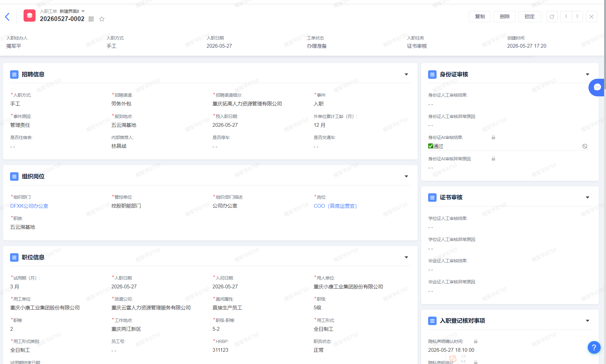

### 5.4.2 RS060101 二维码签到

| **属性** | **内容** |
| --- | --- |
| 编号 | RS060101 |
| 名称/标识符 | 二维码签到 |
| 功能描述 | 员工到达共享中心，扫描现场二维码完成入职签到，系统更新签到时间与状态 |
| 补充说明 | 使用 SAI 2.0（飞书）扫描现场易拉宝二维码完成签到；签到时间作为劳动关系起始日的佐证之一 |

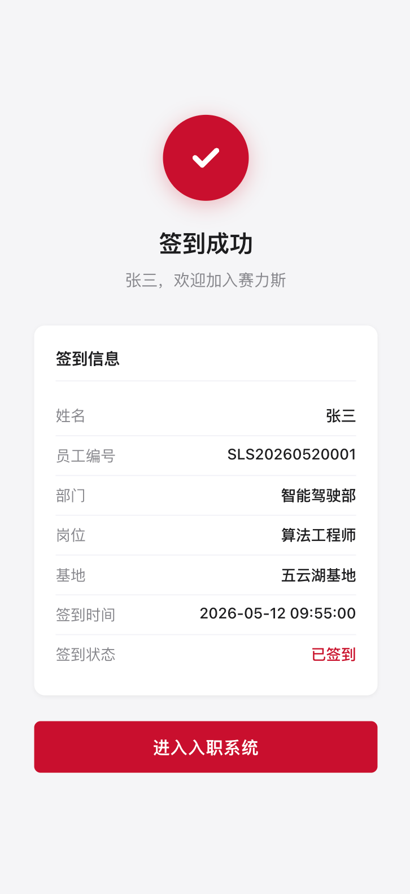

**数据项描述**：

| **数据项名称** | **数据类型** | **数据长度** | **是否必填** | **数据来源** | **备注说明** |
| --- | --- | --- | --- | --- | --- |
| 签到二维码 | 二维码 | — | 是 | 现场易拉宝 | 动态生成 |
| 签到状态 | 枚举 | — | 是 | 系统更新 | 已签到/未签到 |
| 签到时间 | 时间戳 | — | 是 | 系统生成 |  |

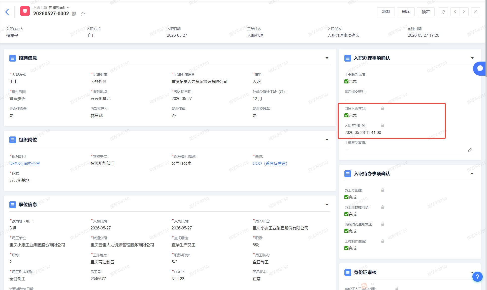

### 5.4.11 RS090102 入职满意度评价

| **属性** | **内容** |
| --- | --- |
| 编号 | RS090102 |
| 名称/标识符 | 入职满意度评价 |
| 功能描述 | 入职工单完成后，系统自动向入职者发送短信/IM 消息，请员工对入职服务进行满意度评价 |
| 补充说明 | 评价结果自动同步至对应入职工单 |

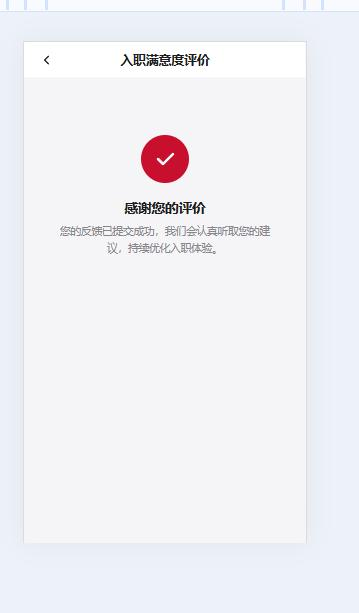
**评价内容**：

| **数据项名称** | **数据类型** | **数据长度** | **是否必填** | **数据来源** | **备注说明** |
| --- | --- | --- | --- | --- | --- |
| 满意度问题1 | 评分 | 1-5 | 是 | 员工 | 对本次入职服务是否满意 |
| 满意度问题2 | 评分 | 1-5 | 是 | 员工 | 对本次入职流程是否满意 |
| 开放性评价 | 文本 | 1000 | 否 | 员工 | 对入职过程的评价内容 |

入职经办人，点击【入职完成】按钮系统将自动向入职者发送满意度评价短信。入职者点击短信中的H5链接，即可进入评价界面。提交评价后，h5页面系统将结果同步至对应工单。

## 5.9 接口需求
### 5.9.1 接口清单

I010 — **工****单创建****与通知**（3 个接口）
创建入职工单，并通过邮件和短信通知待入职人员。

| 编号 | 接口功能 | 消费方 | 提供方 | 备注 |
| --- | --- | --- | --- | --- |
| I010-01-01 创建工单 | 工单记录新建、工单记录上传图片文件 | I9、OA | 工单系统 | 先调用创建记录接口；如有图片和附件，再调用上传接口 |
| I010-03-01 发送入职邮件 | 企业邮箱发送入职邮件给待入职人员 | 工单系统 | 邮件系统 | — |
| I010-04-01 发送入职短信 | 发送入职短信给待入职人员 | 工单系统 | 短信平台 | 短息模板配置在赛力斯短信平台配置，生成templateid； 工单系统平台配置同样的短信模板和维护对应的templateid |

I020 — **移动端交互**（8 个接口）
待入职员工通过移动端完成登录、隐私签署、资料提交、承诺签署、在线客服、AI审核等操作。

| 编号 | 接口功能 | 消费方 | 提供方 | 备注 |
| --- | --- | --- | --- | --- |
| I020-01-01 登录移动端 | 工单记录查询、短信记录保存 | 移动端 | 工单系统 | 根据手机号或员工唯一标识加工单状态查询入职工单 |
| I020-02-01 签订隐私声明 | 调用 DPO 接口，确定是否显示与显示内容 | 移动端 | DPO | DPO 开发中 |
| I020-02-01 签订隐私声明 | 隐私声明阅读状态写入工单 | 移动端 | 工单系统 | — |
| I020-04-01 提交入职资料 | 员工信息写入工单 | 移动端 | 工单系统 | — |
| I020-05-01 真实性承诺签署 | 签署状态写入工单 | 移动端 | 工单系统 | — |
| I020-06-01 在线客服 | 提供在线客服接入文档 | 移动端 | 工单系统 | — |
| I020-07-01 入职信息 AI 审核 | 数据推送 AI 审核 | 移动端 | AI 审核模块 | — |
| I020-07-01 入职信息 AI 审核 | AI 审核结果写入工单 | AI 审核模块 | 工单系统 | — |

I030 — 工单审核（8 个接口）
入职工单审核流程，包括审核不通过通知、审核通过后自动创建员工号、数据同步、合同工单创建与审核。

| 编号 | 接口功能 | 消费方 | 提供方 | 备注 |
| --- | --- | --- | --- | --- |
| I030-01-01 入职工单审核 | 发送审核不通过通知给待入职员工 | 工单系统 | 短信平台 | 短信中包含移动端在线客服跳转 URL 链接 |
| I030-01-01 入职工单审核 | 在线客服了解工单审核情况 | 移动端 | 工单系统 | 客服系统查询工单系统，获取入职资料审核结果 |
| I030-02-01 入职工单审核通过 | 创建员工号接口 | 工单系统 | I9 | "系统自动调用 I9 接口生成员工号，存入工单""员工工号""字段" |
| I030-02-01 入职工单审核通过 | 员工数据同步 SAP 接口 | 工单系统 | SF | 调用 SF/HCM 接口生成员工号，需传入中文全名、地址、电话、紧急联系人、学历等字段 |
| I030-02-01 入职工单审核通过 | 访客预约应用对接接口 | 工单系统 | 访客系统 | 信息推送至访客预约应用，自动发送短信提醒待入职员工 |
| I030-03-01 合同工单创建 | 对接飞书机器人消息接口 | 工单系统 | 飞书 | 通过 IM 给合同审核人发送待审核消息 |
| I030-04-01 合同工单审核通过 | 合同信息同步 | 工单系统 | 合同管理模块 | 合同工单信息推送SF主数据 |
| I030-04-01 合同工单审核通过 | 工单上传文件接口 | 合同管理模块 | 工单系统 | 合同管理模块附件上传到合同工单的文件字段上。 |
| I030-04-01 合同工单审核通过 | 合同文件同步到电子签 | 合同管理模块 | 电子签 | 合同文件推送给电子签，完成对接电子工作 |

I060 — 二维码签到（2 个接口）
入职当天通过飞书扫码完成签到。

| 编号 | 接口功能 | 消费方 | 提供方 | 备注 |
| --- | --- | --- | --- | --- |
| I060-01-01 二维码签到 | 飞书扫码二维码跳转移动端进行签到确认 | 飞书 | 移动端 | — |
| I060-01-02 二维码签到工单 | 签到状态更新到工单 | 移动端 | 工单系统 | — |

I070 — 线上合同推送（1 个接口）
推送签字通知到待入职员工。

| 编号 | 接口功能 | 消费方 | 提供方 | 备注 |
| --- | --- | --- | --- | --- |
| I070-03-01 线上合同推送 | 推送签字通知到待入职员工 | 工单系统 | 飞书 | — |

I080 — 电子签集成（3 个接口）
员工通过移动端完成电子签签署，状态回写工单。

| 编号 | 接口功能 | 消费方 | 提供方 | 备注 |
| --- | --- | --- | --- | --- |
| I080-01-01 登录移动端 | 工单记录查询、短信记录保存 | 移动端 | 工单系统 | — |
| I080-02-01 集成电子签 | 跳转电子签进行员工签字 | 移动端 | 电子签 | — |
| I080-03-01 员工电子签完成 | 员工签字状态写入工单 | 移动端 | 工单系统 | — |

I090 — 报到通知与满意度评价（3 个接口）
入职报到部门通知及入职满意度评价。

| 编号 | 接口功能 | 消费方 | 提供方 | 备注 |
| --- | --- | --- | --- | --- |
| I090-01-01 发送部门报到通知 | 飞书机器人消息对接 | 工单系统 | 飞书 | 选择对应 HRBP 并确认后，系统自动发送飞书消息 |
| I090-02-01 入职满意度评价（飞书） | 发送员工入职欢迎，调整移动端进行入职满意度评价 | 工单系统 | 飞书 | — |
| I090-02-02 入职满意度评价（移动端） | 满意度评价接口 | 移动端 | 工单系统 | 把满意度信息更新到对应工单记录中 |

I110 — 合同用印（1 个接口）
调用电子签用印接口完成合同用印。

| 编号 | 接口功能 | 消费方 | 提供方 | 备注 |
| --- | --- | --- | --- | --- |
| I110-01-01 合同用印 | 调用电子签用印接口 | 工单系统 | 电子签 | 调用慧博封装接口，获取对应参数 + 工单链接，调用电子签接口 |

I120 — 合同领取（2 个接口）
通过飞书和移动端通知员工领取合同。

| 编号 | 接口功能 | 消费方 | 提供方 | 备注 |
| --- | --- | --- | --- | --- |
| I120-01-01 合同领取（飞书） | 发送合同领取通知给到员工 | 工单系统 | 飞书 | — |
| I120-01-02 合同领取（移动端） | 合同记录查询和更新接口 | 移动端 | 工单系统 | "消息 API：发送合同领取通知及跳转链接；工单 API（读取）：读取合同领取状态；工单 API（写入）：记录员工点击""收到""的确认动作" |

I980 — 终止提醒（1 个接口）
发出终止提醒到招聘经办人。

| 编号 | 接口功能 | 消费方 | 提供方 | 备注 |
| --- | --- | --- | --- | --- |
| I980-01-01 发出终止提醒 | 对接飞书机器人消息接口 | 工单系统 | 飞书 | 系统发飞书提醒 |

I000 — 其他集成（2 个接口）
AD域集成与主数据同步。

| 编号 | 接口功能 | 消费方 | 提供方 | 备注 |
| --- | --- | --- | --- | --- |
| I000-01-01 AD 域集成 | 接入企业账号，实现单点登录 | 工单系统 | IAM | 定时拉取 |
| I000-01-02 主数据同步 | 员工数据同步到工单系统 | 工单系统 | HCM | 定时拉取 |

### 5.9.2 接口统计

| 统计项 | 数量 |
| --- | --- |
| 功能模块 | 13 个 |
| 接口总数 | 35 个 |

接口提供方汇总：

| 提供方 | 接口数量 | 说明 |
| --- | --- | --- |
| 工单系统 | 15 | 核心系统，工单增删改查、状态写入 |
| 飞书 | 7 | 机器人消息通知、扫码签到 |
| 电子签 | 4 | 合同签署、用印 |
| 合同管理模块 | 3 | 合同信息管理 |
| I9 | 1 | 员工号生成 |
| SF（SAP） | 1 | 员工数据同步 |
| 邮件系统 | 1 | 入职邮件发送 |
| 短信平台 | 2 | 入职短信、审核通知 |
| DPO | 1 | 隐私声明 |
| AI 审核模块 | 1 | 入职资料 AI 审核 |
| 访客系统 | 1 | 访客预约 |
| HCM | 1 | 主数据同步 |
| IAM | 1 | AD 域（已取消） |

### 5.9.3 工单系统接口总表

| 接口编码 | 标准接口名称 | 核心功能说明 |
| --- | --- | --- |
| SG-API-001 | 创建对象记录 | 创建工单 / 自定义对象基础记录 |
| SG-API-002 | 更新对象记录 | 按 ID 或唯一字段更新记录 |
| SG-API-003 | 查询单条对象记录 | 按 ID 或唯一字段查询记录详情 |
| SG-API-004 | 对象文件图片字段上传 | 上传图片 / 文件到指定工单字段 |
| SG-API-005 | 查询对象文件图片字段列表 | 查询指定工单字段的附件清单 |
| SG-API-006 | 对象文件图片字段删除附件 | 删除单个附件或清空全部附件 |
| SG-API-007 | 外部系统数据推送 | 工单系统主动推送数据至外部系统 |
| SG-API-008 | 查询对象字段列表 | 查询指定对象的所有字段信息 |
| SG-API-009 | 创建对象字段选项值 | 为单选 / 多选 / 级联字段添加选项值 |
| SG-API-0010 | 对象搜索查询记录 | 可以通过多个条件进行搜索，返回匹配的记录列表 |

###  工单系统接口规范.docx
### 5.9.4 工单系统集成总表

| 编码 | 集成系统名称 | 使用场景 | 对接详情 |
| --- | --- | --- | --- |
| INT_EM_01 | 邮件系统集成 | 邮件发送 | 向待入职人员发送邮件 |
| INT_SM_01 | 短信平台集成 | 短信发送 | 向待入职人员发送提醒短信 |
| INT_I9_01 | I9 系统集成 | 员工号生成 | 入职工单审核通过后，自动调用 I9 接口生成唯一员工工号并回写工单 |
| INT_AD_01 | AD 域集成 | 企业邮箱创建 | 员工信息同步完成后，自动创建企业邮箱 |
| INT_SF_01 | SF 主数据同步 | SF→工单同步 | 从 SF 系统拉取人事主数据，同步至入职工单平台 |
| INT_SF_02 | SF 下拉字典获取 | 下拉选项取值 | 获取 SF 主数据字典项，用于前端下拉选择与数据合法性校验 |
| INT_SF_03 | 员工信息回传 SF | 入职工单审核通过→SF 同步 | 入职工单审核通过后，将员工信息同步至 SF 主数据平台 |
| INT_SF_04 | 合同信息回传 SF | 合同用印完成→SF 同步 | 合同完成签署与用印后，将合同信息同步至 SF 主数据平台 |
| INT_VS_01 | 访客预约系统集成 | 访客预约创建 | 为待入职人员自动创建入职当日访客预约并发送提醒短信 |
| INT_FS_01 | 飞书消息集成 | 飞书机器人消息提醒 | 对接飞书机器人，推送待办、合同领取等卡片消息 |
| INT_ES_01 | 电子签系统集成 | 合同签署 / 用印 | 对接慧博电子签，实现合同在线发起、签署、用印及状态回写 |
| INT_IAM_01 | IAM 单点登录集成 | 统一身份认证登录 | 基于 OAuth2.0 协议对接企业 IAM 平台，实现飞书单点登录（SSO） |

# 6 主数据
本模块定义入职系统核心业务流程涉及的全部数据实体，涵盖入职办理、合同签订两大业务的数据结构，以及跨表单的字段关联关系。
*详见** **主数据清单*
### 6.1 数据实体概览
入职系统共涉及 10 个数据实体，以入职工单为核心，合同工单为关联工单，7 个入职工单子表为明细数据：

| 序号 | 数据实体 | API 名称 | 数据来源 | 字段数 | 详细说明 |
| --- | --- | --- | --- | --- | --- |
| 1 | 入职工单 | entryWorkOrder | 入职办理流程 | 111 | 入职工单 |
| 2 | 证件信息 | CertInfo | 入职办理流程 | 8 | 入职工单-证件信息 |
| 3 | 语言能力 | Language | 入职办理流程 | 7 | 入职工单-语言能力 |
| 4 | 正规教育 | Education | 入职办理流程 | 13 | 入职工单-正规教育 |
| 5 | 过往工作经历 | WorkExperience | 入职办理流程 | 12 | 入职工单-过往工作经历 |
| 6 | 家庭成员及社会关系 | FamilyRelation | 入职办理流程 | 12 | 入职工单-家庭成员及社会关系 |
| 7 | 资格证信息 | Certificate | 入职办理流程 | 9 | 入职工单-资格证信息 |
| 8 | 工作许可及签证信息 | VisaPermit | 入职办理流程 | 6 | 入职工单-工作许可及签证信息 |
| 9 | 合同工单 | contractWorkOrder | 合同签订流程 | 78 | 合同工单 |
| 10 | 附件清单 | — | — | 28 | 附件清单 |

数据流转关系：
职位申请表 → 录用审批表 → 入职工单 → 合同工单
关联关系：
- 入职工单 ↔ 合同工单：合同工单通过 relatedWorkOrder 字段关联回入职工单，实现一对一关系
- 入职工单 ↔ 子表：入职工单通过 relatedWorkOrder 字段关联 7 个子表，实现一对多关系
- 入职工单 → 录用审批表：大部分字段由录用审批表同步而来
### 6.2 入职工单
入职工单共 111 个字段，按 8 个信息类型分布：

| 信息类型 | 字段数 | 必填字段数 | 说明 |
| --- | --- | --- | --- |
| 招聘渠道 | 3 | 2 | 招聘渠道、渠道细分、内部推荐人 |
| 组织岗位信息 | 23 | 21 | 事件、管控单位、岗位、职级等 |
| 个人信息 | 24 | 18 | 姓名、证件、国籍、婚姻等 |
| 银行账号 | 2 | 0 | 银行账号、发薪银行 |
| 其他信息 | 15 | 15 | 是否退伍军人、是否残疾人等 |
| 入职附件信息 | 14 | — | 各类附件文件上传 |
| 工单系统字段 | 17 | 5 | 工单状态、审核、签到等 |
| 子表引用 | 7 | — | 7 个子表的关联引用 |

招聘渠道（#1 ~ #3）：

| 序号 | 名称 | 输入类型 | 必填 | 值来源 |
| --- | --- | --- | --- | --- |
| 1 | 招聘渠道 | 列表 | 是 | 录用审批表同步 |
| 2 | 招聘渠道细分 | 列表 | 是 | 录用审批表同步 |
| 3 | 内部推荐人 | 查找员工 | 条件 | "录用审批表同步；招聘渠道 = ""内部推荐""时必填" |

组织岗位信息（#4 ~ #26）：

| 序号 | 名称 | 输入类型 | 必填 | 值来源 |
| --- | --- | --- | --- | --- |
| 4 | 事件 | 列表 | 是 | 系统按规则填充 |
| 5 | 事件原因 | 列表 | 是 | 系统按规则填充 |
| 6 | 管控单位 | 列表 | 是 | 录用审批表同步 |
| 7 | 用工形式类别 | 列表 | 是 | 录用审批表同步 |
| 8 | 用工形式 | 列表 | 是 | 录用审批表同步 |
| 9 | 组织/部门 | 列表 | 是 | 录用审批表同步 |
| 10 | 组织/部门描述 | 文本 | 是 | 录用审批表同步 |
| 11 | 岗位 | 列表 | 是 | 录用审批表同步 |
| 12 | 入司日期 | 日期 | 是 | 录用审批表同步 |
| 13 | 用人单位 | 列表 | 是 | 录用审批表同步 |
| 14 | 工作地点 | 列表 | 是 | 录用审批表同步 |
| 15 | 派遣公司 | 列表 | 否 | 录用审批表同步 |
| 16 | 直间属性 | 列表 | 是 | 录用审批表同步 |
| 17 | 职级 | 列表 | 是 | 录用审批表同步 |
| 18 | 职等 | 列表 | 是 | 录用审批表同步 |
| 19 | 职级-职等 | 文本 | 是 | 录用审批表同步 |
| 20 | 外单位累计工龄（月） | 数字 | 是 | 录用审批表同步；默认值 0 |
| 21 | 用工单位 | 列表 | 是 | 录用审批表同步 |
| 22 | 职员状态 | 列表 | 是 | "录用审批表同步；为""试用""时试用期必填" |
| 23 | 试用期（月） | 数字 | 条件 | 录用审批表同步 |
| 24 | 试用期结束日期 | 日期 | 否 | 系统计算 = 入司日期 + 试用期（月） |
| 25 | 职族 | 列表 | 否 | 录用审批表同步 |
| 26 | 报到地点 | 列表 | 是 | 录用审批表同步 |

个人信息（#27 ~ #50）：

| 序号 | 名称 | 输入类型 | 必填 | 值来源 |
| --- | --- | --- | --- | --- |
| 27 | 员工号 | 文本 | 否 | I9 系统生成 |
| 28 | 中文全名 | 文本 | 是 | 录用审批表同步；须与身份证一致 |
| 29 | 外文全名 | 文本 | 是 | 中文全名自动带出拼音，可手工修改 |
| 30 | 参加工作日期 | 日期 | 是 | 录用审批表同步 |
| 31 | 个人电话 | 电话 | 是 | 录用审批表同步 |
| 32 | 个人邮箱 | 邮箱 | 是 | 录用审批表同步 |
| 33 | 国籍 | 列表 | 是 | 录用审批表同步 |
| 34 | 性别 | 列表 | 是 | 录用审批表同步 |
| 35 | 出生日期 | 日期 | 是 | 录用审批表同步；须与身份证一致 |
| 36 | 婚姻状况 | 列表 | 是 | "录用审批表同步；""已婚""时配偶信息必填" |
| 37 | 结婚日期 | 日期 | 条件 | "婚姻状况 = ""已婚""时展示" |
| 38 | 民族 | 列表 | 条件 | 国籍 = 中国时必填 |
| 39 | 籍贯 | 列表 | 条件 | 国籍 = 中国时必填 |
| 40 | 户口性质 | 列表 | 是 | 录用审批表同步 |
| 41 | 户口所在地 | 列表 | 是 | 须与身份证信息一致 |
| 42 | 政治面貌 | 列表 | 是 | 录用审批表同步 |
| 43 | 入党时间 | 日期 | 条件 | "政治面貌 = ""中共党员""时展示" |
| 44 | 驾照类型 | 列表 | 是 | 员工填入 |
| 45 | 健康状况 | 列表 | 是 | 员工填入 |
| 46 | 不健康说明 | 文本 | 否 | 员工填入 |
| 47 | 身高 | 数字 | 否 | 员工填入 |
| 48 | 体重 | 数字 | 否 | 员工填入 |
| 49 | 家庭地址 | 文本 | 是 | 省/市/区下拉选择，街道手工输入 |
| 50 | 邮政编码 | 数字 | 否 | 员工填入 |

银行账号（#51 ~ #52）：

| 序号 | 名称 | 输入类型 | 必填 | 值来源 |
| --- | --- | --- | --- | --- |
| 51 | 银行账号 | 数字 | 否 | 员工填入；按卡号自动带出发薪银行 |
| 52 | 发薪银行 | 列表 | 否 | 系统自动带出 |

其他信息（#53 ~ #67）：

| 序号 | 名称 | 输入类型 | 必填 | 值来源 |
| --- | --- | --- | --- | --- |
| 53 | 是否复转或退伍军人 | 单选 | 是 | 员工填入 |
| 54 | 是否残疾人 | 单选 | 是 | 员工填入 |
| 55 | 是否有犯罪记录 | 单选 | 是 | 员工填入 |
| 56 | 是否吸毒史 | 单选 | 是 | 员工填入 |
| 57 | 是否有慢性病或重大病史 | 单选 | 是 | 员工填入 |
| 58 | 是否签订竞业协议或禁止协议 | 单选 | 是 | 员工填入 |
| 59 | 是否有知识产权 | 单选 | 是 | 员工填入 |
| 60 | 是否有在其他单位投资或任职 | 单选 | 是 | 员工填入 |
| 61 | 是否与公司有经济业务往来 | 单选 | 是 | 员工填入 |
| 62 | 是否住宿舍 | 单选 | 是 | 员工填入 |
| 63 | 是否建卡贫困户 | 单选 | 是 | 员工填入 |
| 64 | 本人或直系亲属是否经营与公司相同或类似业务 | 单选 | 是 | 员工填入 |
| 65 | 是否停车 | 单选 | 是 | 员工填入 |
| 66 | 是否交通车 | 单选 | 是 | 员工填入 |
| 67 | HRBP | 人员选择 | 是 | 员工填入 |

入职附件信息（#74 ~ #87）：

| 序号 | 名称 | 传入流程 | 保存位置 |
| --- | --- | --- | --- |
| 74 | 《职位申请表》 | 010-入职预约 | 入职工单-附件 |
| 75 | 《面试评估表》 | 入职预约 | 入职工单-附件 |
| 76 | 《背景调查表》 | 入职预约 | 入职工单-附件 |
| 77 | 测评报告 | 入职预约 | 入职工单-附件 |
| 78 | 个人简历 | 入职预约 | 入职工单-附件 |
| 79 | 体检报告 | 入职预约 | 入职工单-附件 |
| 80 | 员工照片 | 入职预约 | 入职工单-附件 |
| 81 | 《资料上传真实性承诺》 | 020-入职登记 | 入职工单-附件 |
| 82 | 个人有效身份证 | 入职登记 | 入职工单-附件 |
| 83 | 毕业证/电子学历注册备案表 | 入职登记 | 入职工单-附件 |
| 84 | 学位证 | 入职登记 | 入职工单-附件 |
| 85 | 学生证 | 入职登记 | 入职工单-附件 |
| 86 | 离职证明/解除劳动合同通知书 | 入职登记 | 入职工单-附件 |
| 87 | 工资银行卡 | 入职登记 | 入职工单-附件 |

工单系统字段（#88 ~ #104）：

| 序号 | 名称 | 必填 | 值来源 |
| --- | --- | --- | --- |
| 88 | 工单状态 | 是 | 系统管理 |
| 90 | 入职预约完成 | 否 | 系统自动 |
| 91 | 发送入职邮件 | 否 | 系统自动 |
| 92 | 发送入职短信 | 否 | 系统自动 |
| 93 | 入职工单审核 | 否 | 入职经办人 |
| 94 | 入职工单审核通过 | 否 | 入职经办人 |
| 95 | 员工入职时间 | 是 | 系统自动 |
| 96 | 工卡激活充值 | 否 | 入职经办人 |
| 97 | 工单签到复审 | 否 | 入职经办人 |
| 98 | 是否签到 | 是 | 系统自动 |
| 99 | 照片审核 | 否 | 入职经办人 |
| 100 | 是否提交照片 | 是 | 入职经办人 |
| 101 | 发送部门报到通知 | 否 | 入职经办人 |
| 102 | 工牌移交完成 | 是 | 入职经办人 |
| 103 | 入职满意度评价 | 否 | 员工评价 |
| 104 | 记录ID | — | PK |

### 6.3 入职工单子表
入职工单关联 7 个子表，通过 relatedWorkOrder 字段与入职工单建立一对多关系：

| 子表 | API 名称 | 字段数 | 说明 |
| --- | --- | --- | --- |
| 证件信息 | CertInfo | 8 | 员工证件信息明细（证件类型、证件号、到期日期、身份证地址等） |
| 语言能力 | Language | 7 | 员工语言能力明细（语种、语言水平、是否第一外语等） |
| 正规教育 | Education | 13 | 员工正规教育经历明细（学校、学历、专业、学位、是否最高学历等） |
| 过往工作经历 | WorkExperience | 12 | 员工过往工作经历明细（工作单位、部门、职位、离职原因等） |
| 家庭成员及社会关系 | FamilyRelation | 12 | 员工家庭成员信息明细（关系类型、姓名、电话、工作单位等） |
| 资格证信息 | Certificate | 9 | 员工资格证信息明细（证书名称、类型、等级、发证单位等） |
| 工作许可及签证信息 | VisaPermit | 6 | 员工工作许可及签证信息明细（证件类型、证件号、到期日期等） |

### 6.4 合同工单
合同工单共 78 个字段，按 5 个信息类型分布：

| 信息类型 | 字段数 | 说明 |
| --- | --- | --- |
| 管控信息 | 10 | 管控单位、岗位、用工形式等 |
| 个人信息 | 2 | 员工号、姓名 |
| 合同参数 | 51 | 合同签订相关的所有参数 |
| 附件清单 | 10 | 各类合同附件 |
| 工单系统字段 | 5 | 审核、用印、关联工单等 |

管控信息（#1 ~ #10）：

| 序号 | 名称 | 输入类型 | 必填 | 值来源 |
| --- | --- | --- | --- | --- |
| 1 | 管控单位 | 列表 | 是 | 系统填充（根据岗位自动带出） |
| 2 | 组织/部门 | 列表 | 是 | 系统填充（根据岗位自动带出） |
| 3 | 岗位 | 列表 | 是 | 入职工单信息 |
| 4 | 用人单位 | 列表 | 是 | 入职工单信息 |
| 5 | 用工单位 | 列表 | 是 | 入职工单信息 |
| 6 | 直间属性 | 列表 | 是 | 入职工单信息 |
| 7 | 用工形式 | 列表 | 是 | 入职工单信息 |
| 8 | 用工形式类别 | 列表 | 是 | 入职工单信息 |
| 9 | 职级 | 列表 | 是 | 入职工单信息 |
| 10 | 合同类型 | 列表 | 是 | 按合同协议生成规则 |

个人信息（#11 ~ #12）：

| 序号 | 名称 | 输入类型 | 必填 | 值来源 |
| --- | --- | --- | --- | --- |
| 11 | 员工号 | 文本 | 是 | 入职工单信息 |
| 12 | 姓名 | 文本 | 是 | 入职工单信息 |

核心合同参数（#13 ~ #27）：

| 序号 | 名称 | 输入类型 | 必填 | 值来源 |
| --- | --- | --- | --- | --- |
| 13 | 性别 | 列表 | 否 | 入职工单信息 |
| 14 | 身份证号码 | 数字 | 否 | 入职工单信息 |
| 15 | 户籍 | 列表 | 否 | 入职工单信息 |
| 16 | 经常居住地 | 文本 | 否 | 入职工单信息 |
| 17 | 邮政编码 | 数字 | 否 | 合同经办人填入 |
| 18 | 电话 | 数字 | 否 | 入职工单信息 |
| 19 | 生效日期 | 日期 | 是 | 系统填充（入职办理日期） |
| 20 | 签订年限 | 列表 | 是 | 录用审批表同步 |
| 21 | 合同到期日期 | 日期 | 是 | 系统计算（= 生效日期 + 签订年限 - 1 天） |
| 22 | 解除/终止日期 | 日期 | 否 | 入职时不用 |
| 23 | 合同状态 | 列表 | 是 | 入职时不用 |
| 24 | 合同签订单位 | 列表 | 是 | 系统填充（= 用工单位） |
| 25 | 签订日期 | 日期 | 是 | 系统填充（= 入职办理日期） |
| 26 | 岗位性质 | 列表 | 是 | 录用审批表同步 |
| 27 | 工时制度 | 列表 | 是 | 录用审批表同步 |

补充协议 &amp; 保密协议（#28 ~ #32）：

| 序号 | 名称 | 输入类型 | 必填 | 值来源 |
| --- | --- | --- | --- | --- |
| 28 | 是否有补充协议 | 列表 | 否 | 系统填充（按合同协议生成规则） |
| 29 | 补充协议违约金 | 数字 | 否 | 系统填充（按合同工单默认值配置表） |
| 30 | 保密协议期限 | 列表 | 否 | 合同经办人填入 |
| 31 | 保密协议违约金 | 数字 | 否 | 系统填充（按保密协议违约金规则） |
| 32 | 合同备注 | 文本 | 否 | 合同经办人填入 |

试用期 &amp; 职级（#33 ~ #39）：

| 序号 | 名称 | 输入类型 | 必填 | 值来源 |
| --- | --- | --- | --- | --- |
| 33 | 试用期（月） | 数字 | 否 | 录用审批表同步 |
| 34 | 职族 | 列表 | 否 | 录用审批表同步 |
| 35 | 国家 | 列表 | 否 | 入职工单信息 |
| 36 | 职员状态 | 列表 | 否 | 入职工单信息 |
| 37 | 工作地点 | 级联 | 否 | 系统填充（根据岗位自动带出） |
| 38 | 公司初次入职日期 | 日期 | 否 | 系统填充（根据员工号找历史入职记录） |
| 39 | 入司日期 | 日期 | 否 | 系统填充（合同签订当天日期） |

安全 &amp; 合规（#40 ~ #41）：

| 序号 | 名称 | 输入类型 | 必填 | 值来源 |
| --- | --- | --- | --- | --- |
| 40 | 是否职业危害告知书 | 列表 | 否 | 合同经办人填入 |
| 41 | 是否已完成特殊工时申报 | 列表 | 否 | 合同经办人填入 |

法人信息（#42 ~ #46）：

| 序号 | 名称 | 输入类型 | 必填 | 值来源 |
| --- | --- | --- | --- | --- |
| 42 | 经济性质 | 文本 | 否 | 系统填充（用工单位法人信息配置表） |
| 43 | 法定代表人 | 文本 | 否 | 系统填充（用工单位法人信息配置表） |
| 44 | 地址 | 文本 | 否 | 系统填充（用工单位法人信息配置表） |
| 45 | 邮政编码 | 数字 | 否 | 系统填充（用工单位法人信息配置表） |
| 46 | 联系电话 | 数字 | 否 | 系统填充（用工单位法人信息配置表） |

试用期时间 &amp; 薪资（#47 ~ #50）：

| 序号 | 名称 | 输入类型 | 必填 | 值来源 |
| --- | --- | --- | --- | --- |
| 47 | 试用期开始时间 | 日期 | 否 | 系统填充（合同签订当天日期） |
| 48 | 试用期结束时间 | 日期 | 否 | 系统计算（= 开始时间 + 试用期月数 - 1 天） |
| 49 | 试用期月工资 | 数字 | 否 | 系统带出（合同工单默认值配置表） |
| 50 | 转正月工资 | 数字 | 否 | 系统带出（合同工单默认值配置表） |

实习生专用（#51 ~ #54）：

| 序号 | 名称 | 输入类型 | 必填 | 值来源 |
| --- | --- | --- | --- | --- |
| 51 | 大学名 | 文本 | 否 | 录用审批表同步 |
| 52 | 学生届数 | 文本 | 否 | 录用审批表同步 |
| 53 | 学历层次 | 文本 | 否 | 录用审批表同步 |
| 54 | 实习工资 | 数字 | 否 | 录用审批表同步 |

竞业限制（#55 ~ #56）：

| 序号 | 名称 | 输入类型 | 必填 | 值来源 |
| --- | --- | --- | --- | --- |
| 55 | 竞业限制名单1 | 单选 | 否 | 合同经办人选择指定模板 |
| 56 | 竞业限制名单2 | 单选 | 否 | 合同经办人选择指定模板 |

签订信息（#57 ~ #59）：

| 序号 | 名称 | 输入类型 | 必填 | 值来源 |
| --- | --- | --- | --- | --- |
| 57 | 签订时间（年/月/日） | 日期 | 否 | 系统填充（合同签订当天日期） |
| 58 | 签订地点（市/区） | 级联 | 否 | 系统填充（按报到地点对应规则） |
| 59 | 派遣公司名称 | 文本 | 否 | 录用审批表同步 |

职业健康（#60 ~ #63）：

| 序号 | 名称 | 输入类型 | 必填 | 值来源 |
| --- | --- | --- | --- | --- |
| 60 | 职业病名称 | 文本 | 否 | 合同经办人填入 |
| 61 | 劳保用品 | 文本 | 否 | 合同经办人填入 |
| 62 | 劳动合同期限类型 | 单选 | 否 | 合同经办人填入 |
| 63 | 危害因素 | 文本 | 否 | 合同经办人填入 |

附件清单（#64 ~ #73）：

| 序号 | 名称 | 保存位置 |
| --- | --- | --- |
| 64 | 入职承诺 | 合同工单-附件 |
| 65 | 网络与数据安全责任承诺书 | 合同工单-附件 |
| 66 | 个人健康状况承诺书 | 合同工单-附件 |
| 67 | 劳动合同 | 合同工单-附件 |
| 68 | 劳务协议 | 合同工单-附件 |
| 69 | 实习协议 | 合同工单-附件 |
| 70 | 非全日制劳动合同 | 合同工单-附件 |
| 71 | 补充协议 | 合同工单-附件 |
| 72 | 保密协议 | 合同工单-附件 |
| 73 | 廉洁协议 | 合同工单-附件 |

工单系统字段（#74 ~ #78）：

| 序号 | 名称 | 必填 | 值来源 |
| --- | --- | --- | --- |
| 74 | 合同工单审核通过 | 否 | 合同经办人 |
| 75 | 线上合同推送 | 否 | 系统自动 |
| 76 | 合同公司用印 | 否 | 系统自动 |
| 77 | 关联工单 | 是 | FK，指向入职工单 |
| 78 | 记录ID | — | PK |

### 6.5 附件清单
各用工形式下入职/合同所需的附件清单，按传入流程分类：
必须附件（所有用工形式通用）：

| 序号 | 名称 | 传入流程 | 保存位置 |
| --- | --- | --- | --- |
| 1 | 《职位申请表》 | 010-入职预约 | 入职工单-附件 |
| 2 | 《面试评估表》 | 入职预约 | 入职工单-附件 |
| 3 | 《背景调查表》 | 入职预约 | 入职工单-附件 |
| 4 | 测评报告 | 入职预约 | 入职工单-附件 |
| 5 | 个人简历 | 入职预约 | 入职工单-附件 |
| 6 | 体检报告 | 入职预约 | 入职工单-附件 |
| 7 | 员工照片 | 入职预约 | 入职工单-附件 |
| 8 | 《资料上传真实性承诺》 | 020-入职登记 | 合同工单-附件 |
| 9 | 个人有效身份证 | 入职登记 | 入职工单-附件 |
| 10 | 毕业证/电子学历注册备案表 | 入职登记 | 入职工单-附件 |
| 11 | 学位证 | 入职登记 | 入职工单-附件 |
| 14 | 工资银行卡 | 入职登记 | 入职工单-附件 |
| 15 | 《入职承诺书》 | 100-入职培训 | 合同工单-附件 |
| 16 | 《网络与数据安全责任承诺书》 | 入职培训 | 合同工单-附件 |

按需附件：

| 序号 | 名称 | 传入流程 | 适用场景 |
| --- | --- | --- | --- |
| 12 | 学生证 | 入职登记 | 仅实习生 |
| 13 | 离职证明/解除劳动合同通知书 | 入职登记 | 有工作经历者 |
| 17 | 《个人健康状况承诺书》 | 入职培训 | 按需 |
| 18 | 《劳动合同》 | 120-合同用印 | 全日制 |
| 19 | 《劳务协议》 | 合同用印 | 劳务用工 |
| 20 | 《实习协议》 | 合同用印 | 实习生 |
| 21 | 《非全日制劳动合同》 | 合同用印 | 非全日制 |
| 22 | 《补充协议》 | 合同用印 | 竞业协议 |
| 23 | 《保密协议》 | 合同用印 | 所有用工形式 |
| 24 | 《廉洁协议》 | 合同用印 | 全日制、劳务用工、派遣人员 |
| 25 | 《见习协议》 | 合同用印 | 按需 |
| 26 | 《无招聘费用返费承诺书》 | 合同用印 | 按需 |
| 27 | 《无竞业限制申明》 | 合同用印 | 按需 |
| 28 | 《职业病危害因素告知书》 | 合同用印 | 按需 |

# 7. 产品的非功能性需求
## 7.1 用户界面需求

| **需求名称** | **详细要求** |
| --- | --- |
| **PC 端界面** | 采用 Web 浏览器访问，支持 Chrome 90+、Edge 90+、Safari 14+、Firefox 88+，遵循赛力斯集团 UI 设计规范 |
| **移动端界面** | 支持 iOS 13+ 和 Android 9+，采用 H5 页面适配，操作简洁直观，适合首次使用的待入职人员，支持分步引导填写 |
| **色彩基调** | 采用赛力斯集团品牌色系，以企业红为主色调，搭配白色背景 |
| **布局要求** | PC 端采用左侧导航 + 右侧内容区布局；移动端采用卡片式布局，信息层次清晰 |
| **工单列表页** | 支持多维度筛选和排序，支持批量操作（勾选复选框），每页 20 条数据，支持分页 |
| **表单填写页** | 分步引导，明确标注必填项和选填项，字段有填写说明和示例，支持暂存和分次填写 |
| **消息提醒** | 操作结果即时反馈（Toast 提示），关键操作二次确认（弹窗确认） |

## 7.2 工单文件存储
路径模板公式
file/{tenant_id}/{category}/{yyyyMMdd}/{random_chars}/{original_filename}

参数说明
- {tenant_id} - 租户ID（数字）
- {category} - 文件分类
- {yyyyMMdd} - 当前日期（格式：20260530）
- {random_chars} - 随机字母数字字符串
- {original_filename} - 用户上传的原始文件名

| **层级** | **说明** |
| --- | --- |
| 域名 | OSS 存储桶域名 |
| 文件类型标识 | 固定前缀file，表示这是文件存储 |
| 租户 ID | 企业或租户的唯一标识 |
| 分类类型 | 文件分类标识 |
| 日期目录 | 上传日期，格式为 YYYYMMDD |
| 随机文件夹 | 随机生成的位字符串，用于避免文件重名 |
| 原始文件名 | 用户上传时的原始文件名 |

## 7.3 软硬件环境需求
### 7.3.1 服务器端

| **需求名称** | **详细要求** |
| --- | --- |
| 应用服务器 | 支持容器化部署（Docker/K8s），满足等保 2.0 三级要求 |
| 数据库 | 关系型数据库，支持千万级数据量，主从复制，读写分离 |
| 文件存储 | 支持大文件存储和快速下载，合同文件加密存储 |
| 缓存 | Redis 或同等缓存方案，支持会话管理和数据缓存 |
| 消息队列 | 支持异步消息处理（AI审核、通知发送等异步场景） |

### 7.3.2 客户端

| **需求名称** | **详细要求** |
| --- | --- |
| PC 浏览器 | Chrome 90+（推荐）、Edge 90+、Safari 14+、Firefox 88+，不支持 IE |
| 移动端 | iOS 13+、Android 9+，各品牌设备适配 |
| 网络要求 | 支持 4G/5G/WiFi 环境，弱网环境下基本功能可用 |
| 现场设备 | 签到二维码易拉宝、工卡读卡器、扫描仪（档案归档用） |

## 7.4 产品质量需求

| **主要质量属性** | **详细要求** |
| --- | --- |
| **正确性** | 合同关键条款准确率 100%，数据校验规则覆盖率 100%（122 个字段校验规则），AI 审核身份证准确率 ≥99% |
| **可靠性** | 系统可用性 ≥99.9%（年度停机时间 &lt;8.76 小时），故障恢复时间 &lt;1 小时，数据恢复点 &lt;1 小时 |
| **性能** | 页面加载 ≤2 秒，表单提交 ≤3 秒，查询操作 ≤1 秒，合同生成 ≤10 秒/份，批量操作（50条）≤30 秒；并发支持：日常 100 人、高峰 300 人、峰值 500 人 |
| **易用性** | 待入职人员无需培训即可使用移动端自助服务；入职经办人培训时间 ≤2 天；操作步骤从 36 个活动优化至 15 个活动 |
| **安全性** | 基于 RBAC 的权限控制，敏感数据（身份证号、手机号、银行卡号）脱敏展示和 AES-256 加密存储，全站 HTTPS（TLS 1.2+），全量操作日志（保留 ≥3 年），等保 2.0 三级合规 |
| **可扩展性** | 模块化业务架构，支持后续扩展调动、续签、社保、考勤等模块；合同模板方案可配置化，支持新增合同类型 |
| **兼容性** | 浏览器兼容 Chrome/Edge/Safari/Firefox 主流版本；移动端兼容 iOS 13+/Android 9+；与 I9、OA、SF、电子签等 7 大外部系统集成 |
| **可移植性** | 支持容器化部署，不绑定特定云平台；数据库可迁移 |

## 7.5 故障处理

| **故障描述** | **详细要求** |
| --- | --- |
| **服务器故障** | 应用服务器双节点部署，主节点故障时自动切换至备用节点；数据库主从切换时间 ≤5 分钟；定时全量备份（每周）+ 增量备份（每日），备份数据异地存储 |
| **系统运行故障** | 记录详细错误日志（时间、模块、错误码、堆栈信息）；关键操作失败后支持重试（如邮件/短信发送失败自动重试 3 次）；AI 审核服务不可用时自动降级为纯人工审核 |
| **用户操作不正确** | 表单实时校验，即时提示错误原因；关键操作（终止入职、合同推送等）二次确认；操作失误支持撤销（在限定时间内）；提供在线客服入口，随时获得帮助 |
| **外部系统故障** | 外部接口调用超时（30秒）自动熔断；失败请求进入重试队列（最多重试 3 次，间隔递增）；降级策略：电子签不可用时切换至线下签署模式 |
| **网络故障** | 移动端支持离线暂存，网络恢复后自动同步；弱网环境下基本功能可用（信息查看、表单填写） |
| **数据错误** | 数据异常时记录错误日志并通知管理员；支持数据修正流程（审批后修改）；定期进行数据一致性检查 |
