### F020 入职登记

### 5.3.5 RS020101 登录移动端

| **属性** | **内容** |
| --- | --- |
| 编号 | RS020101 |
| 名称/标识符 | 登录移动端 |
| 功能描述 | 通过短信/邮件触达，实现员工身份自动识别与待办任务精准推送 |
| 补充说明 | 员工点击入职通知中的专属链接，通过"手机号 + 验证码"一键登录 |

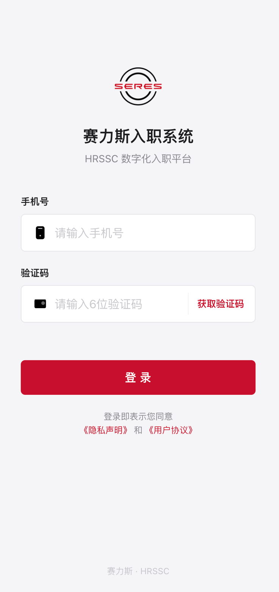

**数据项描述**：

| **数据项名称** | **数据类型** | **数据长度** | **是否必填** | **数据来源** | **备注说明** |
| --- | --- | --- | --- | --- | --- |
| 手机号码 | 文本 | 11 | 是 | 入职通知 | 用于验证码发送和身份识别 |
| 验证码 | 文本 | 6 | 是 | 短信 API | 有效期 5 分钟 |
| 工单状态 | 枚举 | — | 是 | 工单 API | 判断员工需进入的页面 |

### 5.3.6 RS020102 签订隐私声明

| **属性** | **内容** |
| --- | --- |
| 编号 | RS020102 |
| 名称/标识符 | 签订隐私声明 |
| 功能描述 | 调用 DPO 隐私协议服务，展示隐私协议内容，员工签署后记录确认状态 |
| 补充说明 | 未确认隐私声明的员工，不允许进入后续资料填写环节 |

**数据项描述**：

| **数据项名称** | **数据类型** | **数据长度** | **是否必填** | **数据来源** | **备注说明** |
| --- | --- | --- | --- | --- | --- |
| 隐私声明内容 | 富文本 | — | 是 | DPO 服务 | 由 DPO 系统管理 |
| 确认状态 | 布尔 | — | 是 | 员工操作 | 已确认/未确认 |
| 确认时间 | 时间戳 | — | 是 | 系统生成 |  |
| 工单状态 | 列表 | \- | 是 | 工单系统 | 设置成入职指引查阅 |

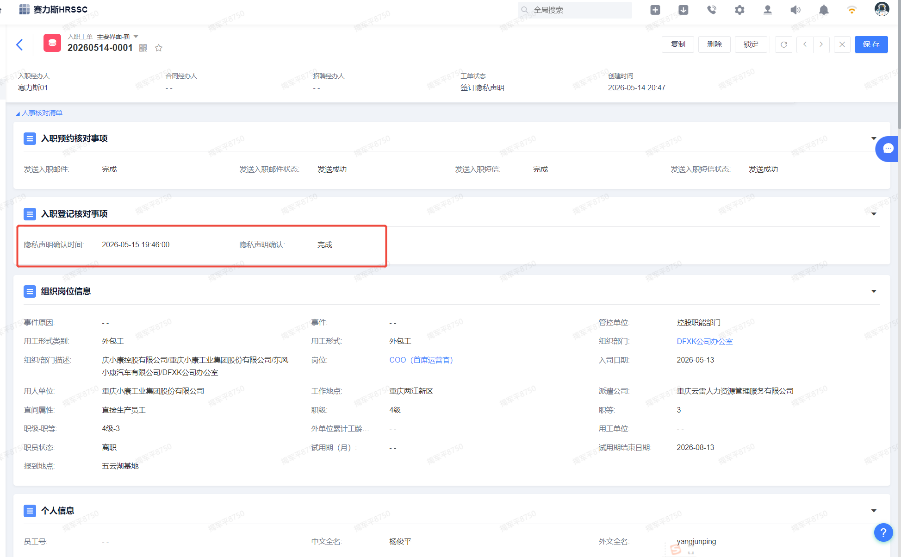

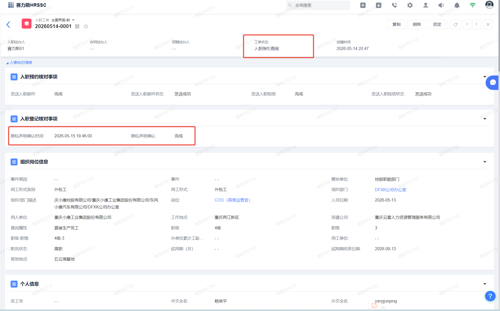

工单只记录结果，信息配置尾部，不做规则校验。

### 5.3.7 RS020103 入职指引查阅

| **属性** | **内容** |
| --- | --- |
| 编号 | RS020103 |
| 名称/标识符 | 入职指引查阅 |
| 功能描述 | 展示入职指引信息，包括入职流程说明、所需材料清单、注意事项等，帮助员工了解入职流程 |
| 补充说明 | 入职指引内容根据基地和用工形式动态展示，确保信息的准确性和针对性 |

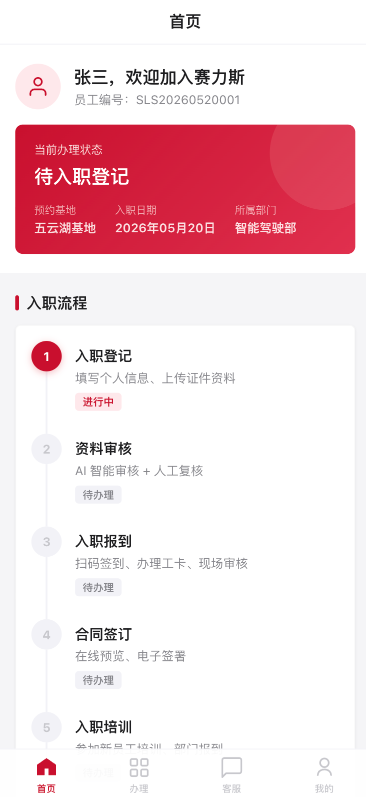

**数据项描述**：

| **数据项名称** | **数据类型** | **数据长度** | **是否必填** | **数据来源** | **备注说明** |
| --- | --- | --- | --- | --- | --- |
| 入职指引内容 | 富文本 | — | 是 | 系统配置 | 根据基地 × 用工形式动态匹配 |
| 阅读确认状态 | 布尔 | — | 否 | 员工操作 | 已阅读/未阅读 |
| 阅读时间 | 时间戳 | — | 否 | 系统生成 |  |
| 工单状态 | 列表 | \- | 否 |  | 入职资料填写中 |

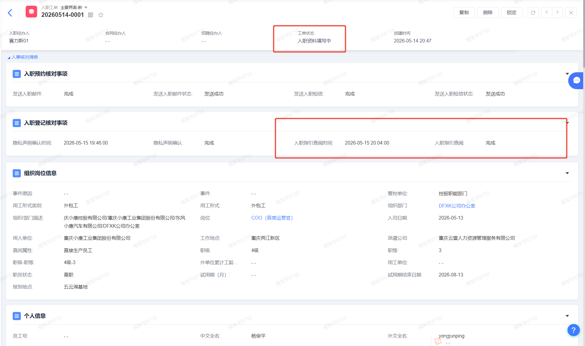

字段保留，配置不可见，不做任何规则处理。

### 5.3.8 RS020104 提交入职资料

| **属性** | **内容** |
| --- | --- |
| 编号 | RS020104 |
| 名称/标识符 | 提交入职资料 |
| 功能描述 | 员工根据页面提示，填写个人信息并上传相关证明材料（支持录入/暂存/提交三种模式） |
| 补充说明 | 13 个信息类型、若干上传附件、122 个业务字段校验规则 |

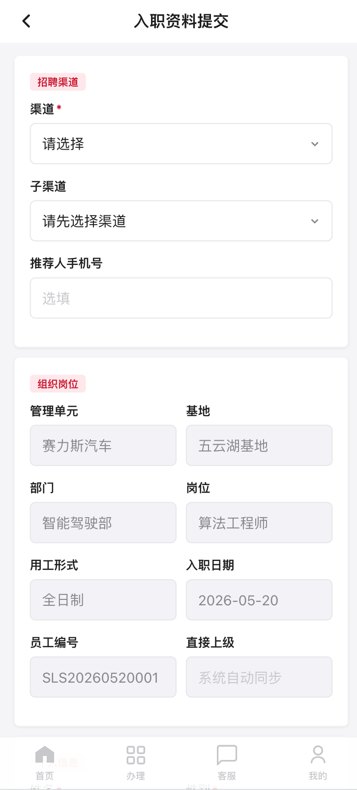 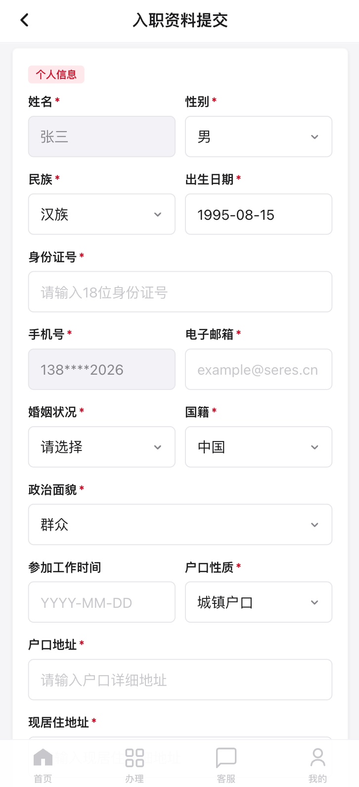 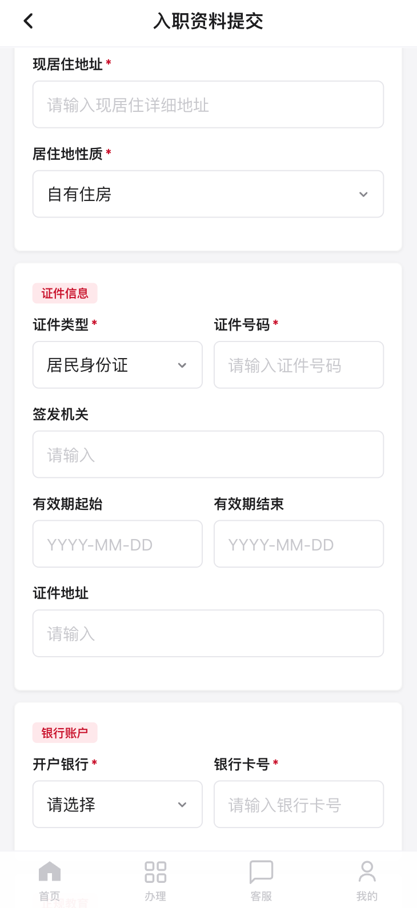

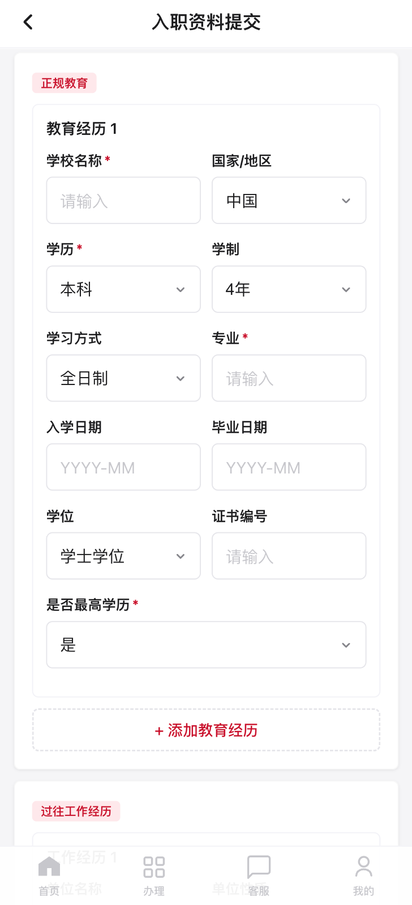 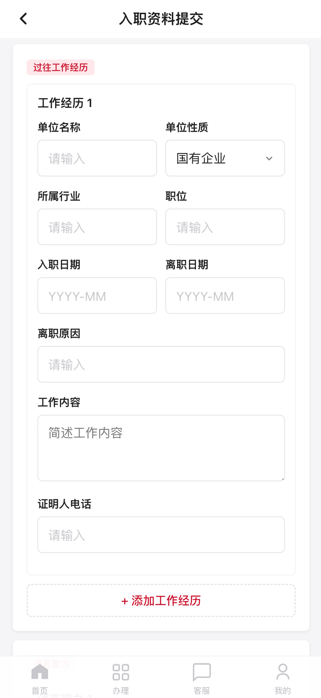 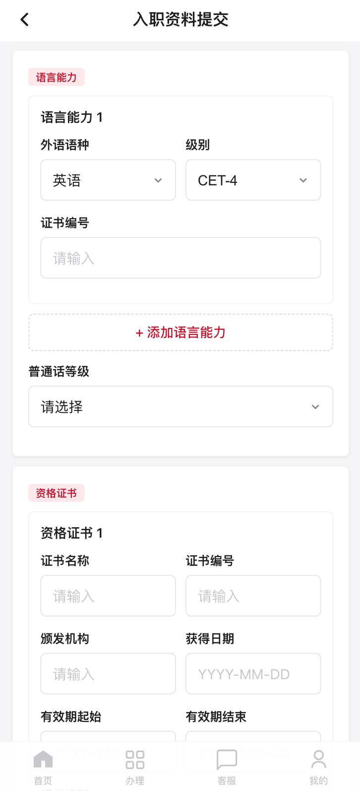

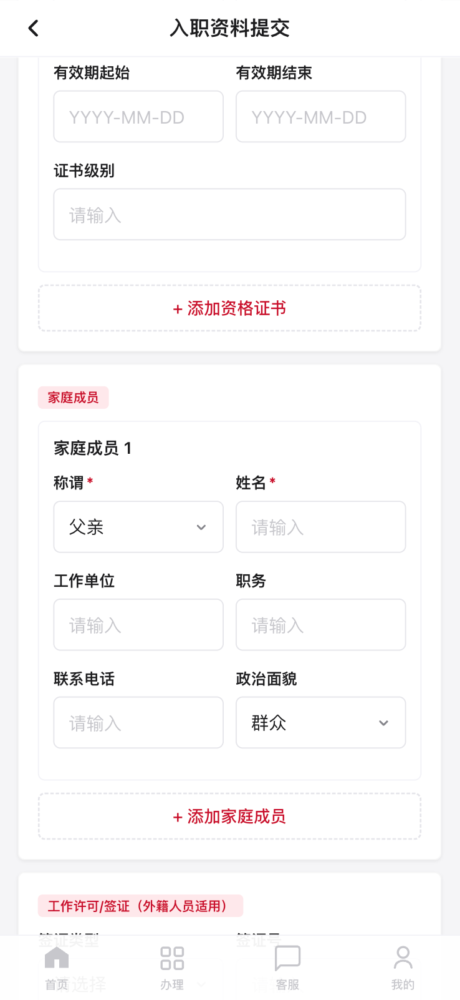 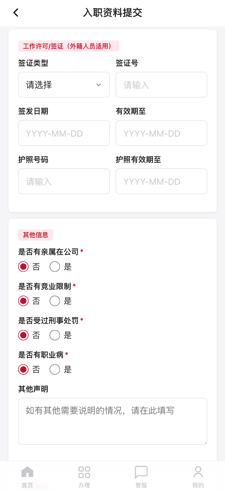 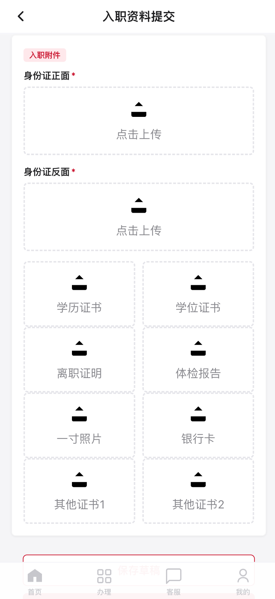

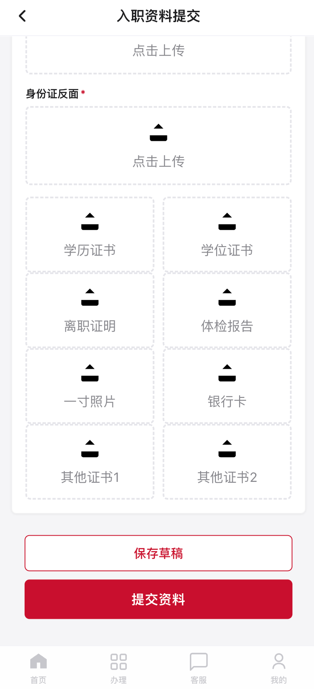

**数据项描述（主要信息类型）**：

| **数据项名称** | **数据类型** | **数据长度** | **是否必填** | **数据来源** | **备注说明** |
| --- | --- | --- | --- | --- | --- |
| 组织岗位信息 | 结构化 | — | 是 | 工单预填 | 入职单位、部门、岗位等 |
| 个人基本信息 | 结构化 | — | 是 | 员工填写 | 姓名、性别、出生日期、民族等 |
| 身份证件信息 | 结构化 | — | 是 | 员工填写 | 含证件类型和号码 |
| 联系方式 | 结构化 | — | 是 | 员工填写 | 手机号、邮箱、紧急联系人 |
| 正规教育（明细表） | 表格 | — | 是 | 员工填写 | 最高学历必填 |
| 过往工作经历（明细表） | 表格 | — | 是 | 员工填写 |  |
| 家庭成员及社会关系（明细表） | 表格 | — | 是 | 员工填写 |  |
| 银行账号 | 结构化 | — | 是 | 员工填写 | 工资卡信息 |
| 身份证照片（正面/反面） | 文件 | — | 是 | 员工上传 | JPG/PNG，AI审核对象 |
| 学历证明 | 文件 | — | 是 | 员工上传 |  |
| 离职证明 | 文件 | — | 条件必填 | 员工上传 | 有工作经历者必填 |
| 登记照（1寸红底白衬衣） | 文件 | — | 是 | 员工上传 | 电子版 |

**功能要求**：

• **暂存功能**：员工填写时可"暂存"，只保存数据不改工单状态

• **提交功能**：点击"提交"保存数据并弹出真实性承诺

• **校验规则**：122 个业务字段校验规则，含格式校验、逻辑校验、必填校验

• **移动端适配**：Web 与移动端页面需要做适配

入职信息提交完成，设置【工单状态】 真实性承诺签署 入职真实性承诺

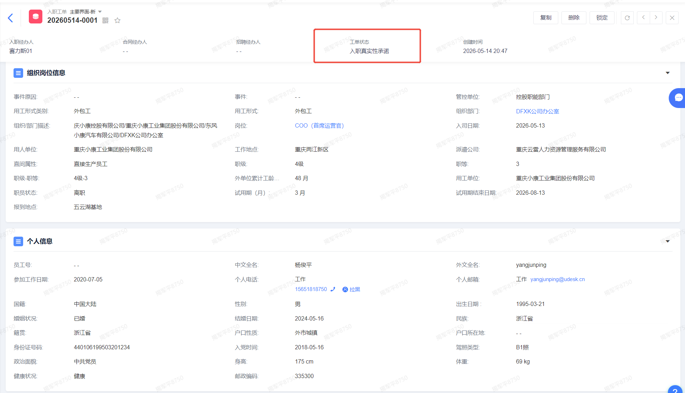

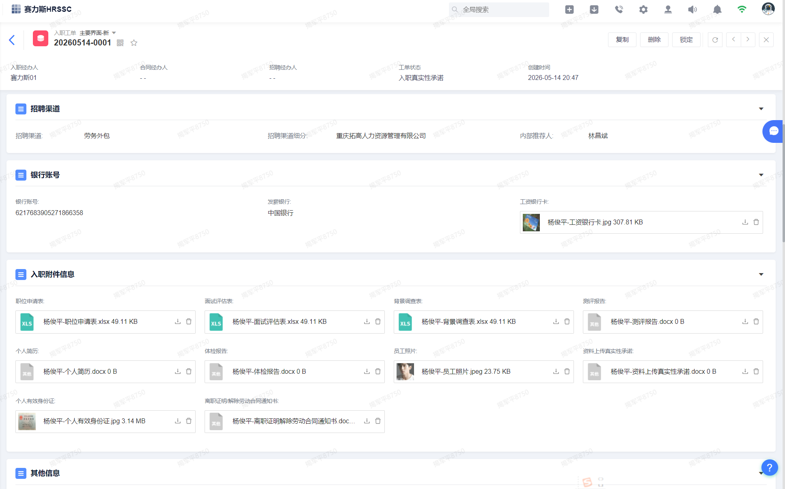

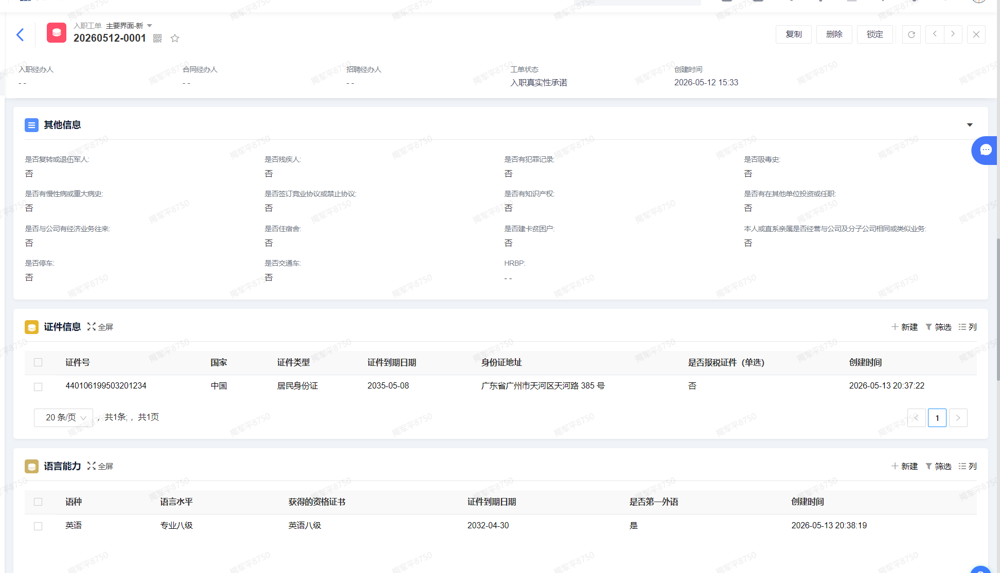

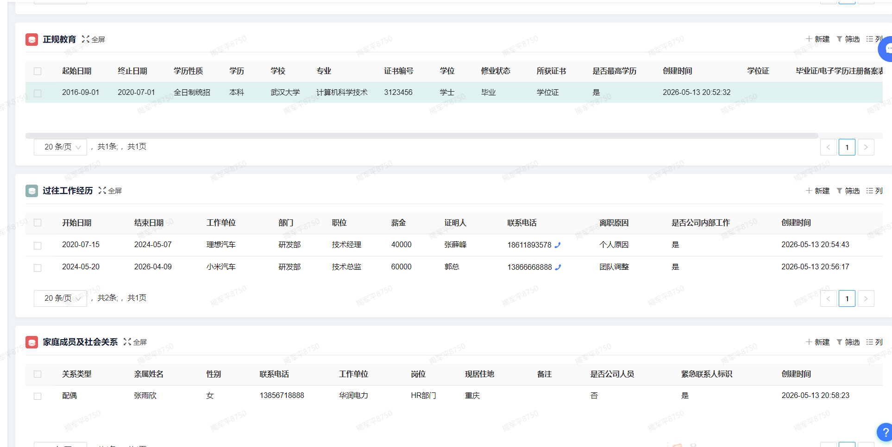

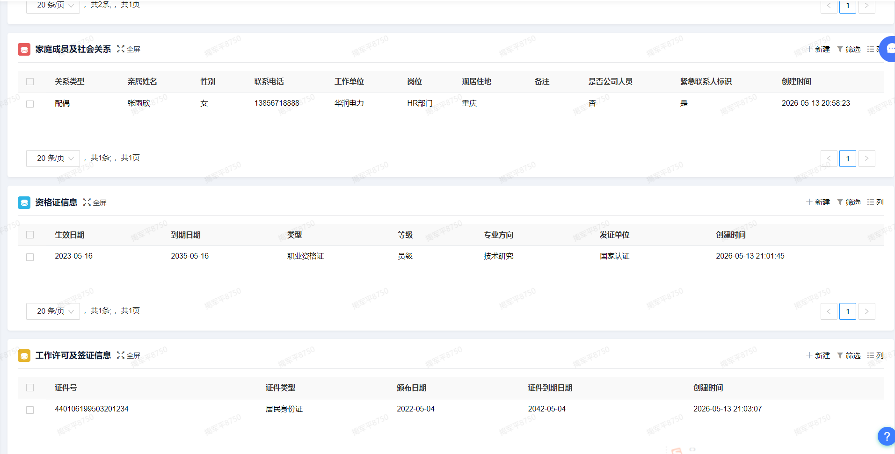

TODO 工单系统 保留哪些字段，单独评审确认。工作经历电话等属性。

### 5.3.9 RS020105 真实性承诺签署

| **属性** | **内容** |
| --- | --- |
| 编号 | RS020105 |
| 名称/标识符 | 真实性承诺签署 |
| 功能描述 | 员工提交入职资料前，需签署真实性承诺书，承诺所填信息真实有效 |
| 补充说明 | 未签署真实性承诺的员工，不允许提交入职资料；承诺书签署后不可撤销 |

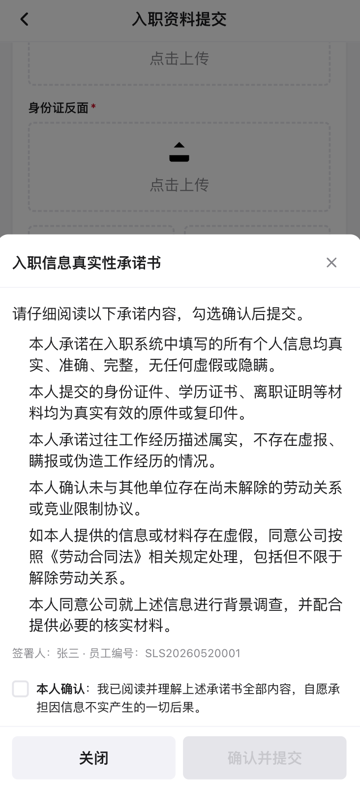

**数据项描述**：

| **数据项名称** | **数据类型** | **数据长度** | **是否必填** | **数据来源** | **备注说明** |
| --- | --- | --- | --- | --- | --- |
| 承诺书内容 | 富文本 | — | 是 | 系统配置 | 标准承诺书模板 |
| 确认状态 | 布尔 | — | 是 | 员工操作 | 已确认/未确认 |
| 确认时间 | 时间戳 | — | 是 | 系统生成 |  |
| 工单状态 | 列表 |  | 是 |  | 入职资料审核 |

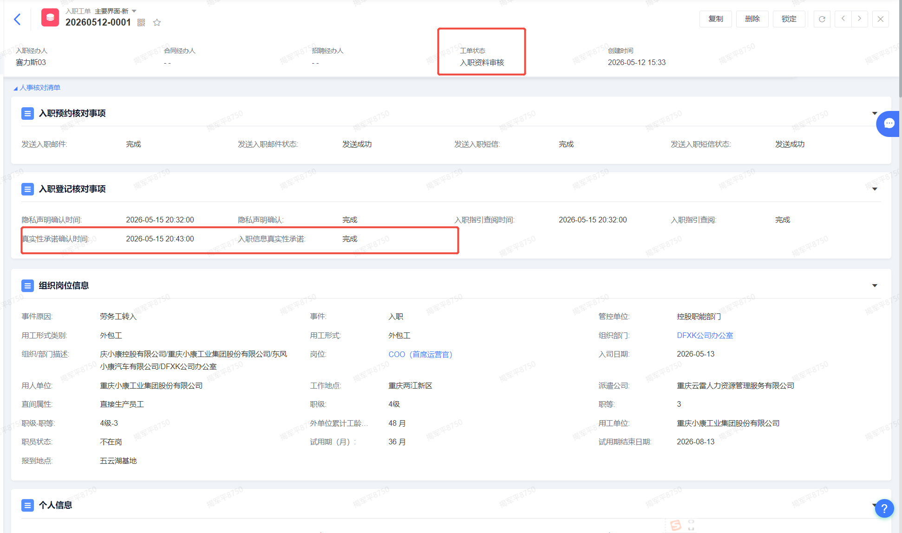

### 5.3.10 RS020106 在线客服

| **属性** | **内容** |
| --- | --- |
| 编号 | RS020106 |
| 名称/标识符 | 在线客服 |
| 功能描述 | 提供在线客服入口，支持 AI 智能客服和人工客服两种模式，解答员工在入职登记过程中的疑问 |
| 补充说明 | 7×24 小时服务；AI 客服自动回答常见问题，复杂问题自动转接人工客服 |

**功能要求**：

• 页面右下角悬浮客服入口，随时可呼起

• AI 客服优先响应，无法解决时提供转人工按钮

• 客服会话记录关联到入职工单，便于后续追溯

TODO： 在线客服整体方案评审。 入职登记环节，工单系统核心，在线客服为辅助答疑。

**数据项描述**：

| **数据项名称** | **数据类型** | **数据长度** | **是否必填** | **数据来源** | **备注说明** |
| --- | --- | --- | --- | --- | --- |
| 客服会话 ID | 文本 | 50 | 是 | 系统生成 | 关联到入职工单 |
| 客服类型 | 枚举 | — | 是 | 系统 | AI 客服/人工客服 |
| 会话记录 | 富文本 | — | 是 | 系统 | 完整对话记录 |

### 5.3.11 RS020107 入职信息 AI 审核

| **属性** | **内容** |
| --- | --- |
| 编号 | RS020107 |
| 名称/标识符 | 入职信息 AI 审核 |
| 功能描述 | 员工提交入职信息后异步发起 AI 审核任务，审核完成后将结果更新至工单 |
| 补充说明 | 本期实施范围：通过 Dify 视觉模型识别身份证图片内容 + 字段比对；后续扩展工作经历、教育信息、银行卡校验 |

**审核流程**：

员工提交入职资料

↓

系统触发 AI 审核任务，进入队列

↓

Dify 视觉模型识别身份证图片内容（正反面并行）

↓

9 条审核规则逐条校验（3 条图片识别 + 6 条字段核对）

↓

审核结果回写工单

↓

├── 审核通过 → 无异常字段，进入人工审核待办

├── 审核警告 → 存在留意项，进入人工审核待办（标记警告项供参考）

└── 审核错误 → 存在异常项，推送异常通知

**数据项描述**：

| **数据项名称** | **数据类型** | **数据长度** | **是否必填** | **数据来源** | **备注说明** |
| --- | --- | --- | --- | --- | --- |
| 审核结果 | 枚举 | — | 是 | AI 模块 | 通过/警告/错误（三级） |
| 审核规则明细 | 列表 | — | 是 | AI 模块 | 9 条审核规则的逐条结果（3 条图片识别 + 6 条字段核对） |
| 异常字段列表 | 列表 | — | 条件必填 | AI 模块 | 异常时必填 |
| 异常描述 | 文本 | 500 | 条件必填 | AI 模块 | 具体异常原因 |

**异常处理**：

• 推送异常通知：入职经办人可点击推送异常按钮，发出 IM 通知消息

• 员工重新修改：员工根据客服反馈补充或修正资料后重新提交

**降级策略**：

• AI 审核服务不可用时（如 Dify 平台故障），系统自动重试 3 次（间隔 30 秒）

• 重试仍失败后，生成降级报告标记"AI 服务不可用"，自动降级为纯人工审核

• 降级事件通知入职经办人

**性能要求**：

• 单次审核时间 ≤15 秒（正常情况下）

• 身份证正反面并行识别

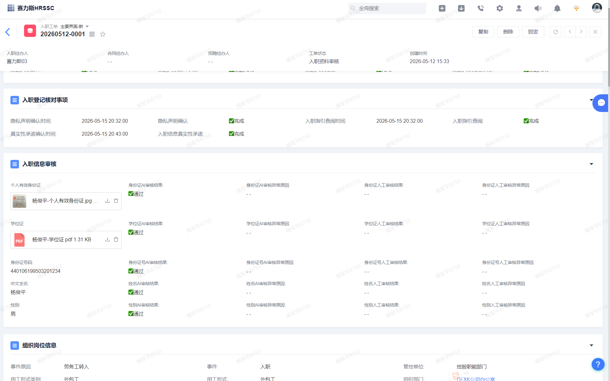

TODO：布局调整：审核内容，人工审核结构，人工审核异常原因，AI审核结构， AI审核异常原因。人工审核异常时， 人工异常原因是比输入项。

TODO 审核表格多行UI验证--教育经历多行审核效果

### 5.4.2 RS060101 二维码签到

| **属性** | **内容** |
| --- | --- |
| 编号 | RS060101 |
| 名称/标识符 | 二维码签到 |
| 功能描述 | 员工到达共享中心，扫描现场二维码完成入职签到，系统更新签到时间与状态 |
| 补充说明 | 使用 SAI 2.0（飞书）扫描现场易拉宝二维码完成签到；签到时间作为劳动关系起始日的佐证之一 |

**数据项描述**：

| **数据项名称** | **数据类型** | **数据长度** | **是否必填** | **数据来源** | **备注说明** |
| --- | --- | --- | --- | --- | --- |
| 签到二维码 | 二维码 | — | 是 | 现场易拉宝 | 动态生成 |
| 签到状态 | 枚举 | — | 是 | 系统更新 | 已签到/未签到 |
| 签到时间 | 时间戳 | — | 是 | 系统生成 |  |

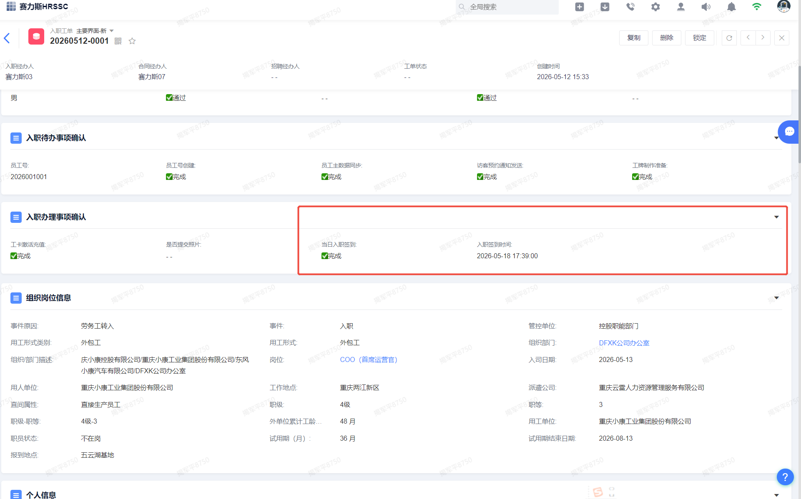

| **属性** | **内容** |
| --- | --- |
| 编号 | RS090101 |
| 名称/标识符 | 发送部门报到通知 |
| 功能描述 | 入职经办人选择对应 HRBP 并确认后，系统自动发送飞书消息，提醒 HRBP 进行领人 |
| 补充说明 | 工牌移交完成后，入职经办人确认工牌状态为"工牌移交完成"，入职工单状态更新为"完成" |

**数据项描述**：

| **数据项名称** | **数据类型** | **数据长度** | **是否必填** | **数据来源** | **备注说明** |
| --- | --- | --- | --- | --- | --- |
| HRBP 人员 | 人员选择 | — | 是 | 组织架构 |  |
| 通知发送状态 | 枚举 | — | 是 | IM 系统 | 已发送/发送失败 |
| 工牌移交状态 | 布尔 | — | 是 | 入职经办人 | 完成/未完成 |

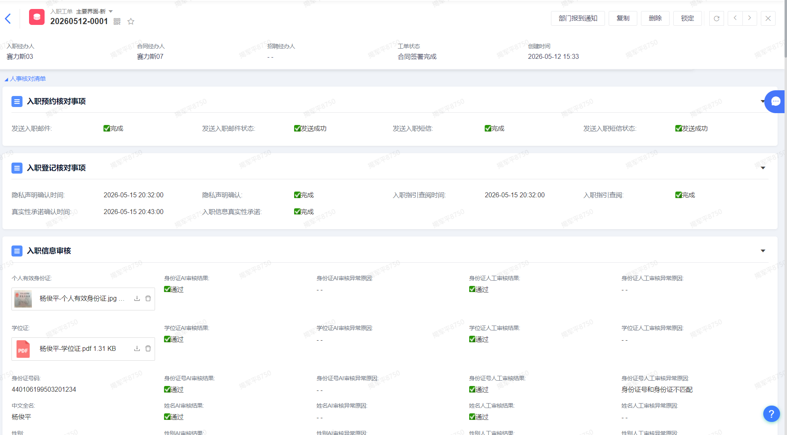

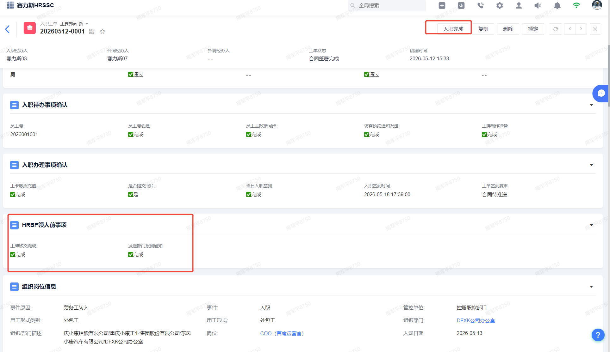

### 5.4.11 RS090102 入职满意度评价

| **属性** | **内容** |
| --- | --- |
| 编号 | RS090102 |
| 名称/标识符 | 入职满意度评价 |
| 功能描述 | 入职工单完成后，系统自动向入职者发送短信/IM 消息，请员工对入职服务进行满意度评价 |
| 补充说明 | 评价结果自动同步至对应入职工单 |

**评价内容**：

| **数据项名称** | **数据类型** | **数据长度** | **是否必填** | **数据来源** | **备注说明** |
| --- | --- | --- | --- | --- | --- |
| 满意度问题1 | 评分 | 1-5 | 是 | 员工 | 对本次入职服务是否满意 |
| 满意度问题2 | 评分 | 1-5 | 是 | 员工 | 对本次入职流程是否满意 |
| 开放性评价 | 文本 | 1000 | 否 | 员工 | 对入职过程的评价内容 |

入职经办人，点击【入职完成】按钮系统将自动向入职者发送满意度评价短信。入职者点击短信中的H5链接，即可进入评价界面。提交评价后，h5页面系统将结果同步至对应工单。

【TODO】短信模板配置内容

H5链接评价后的效果

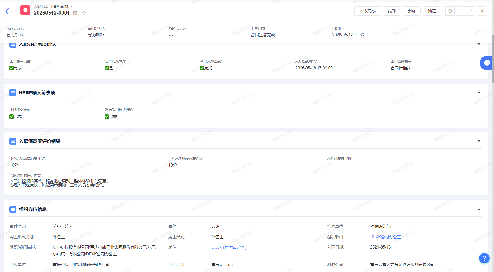

### 5.5.4 RS120102 线下合同领取

| **属性** | **内容** |
| --- | --- |
| 编号 | RS120102 |
| 名称/标识符 | 线下合同领取 |
| 功能描述 | 员工扫描二维码确认领取，系统更新工单状态后完成纸质合同领取 |
| 补充说明 | 扫码确认确保法律效力 |

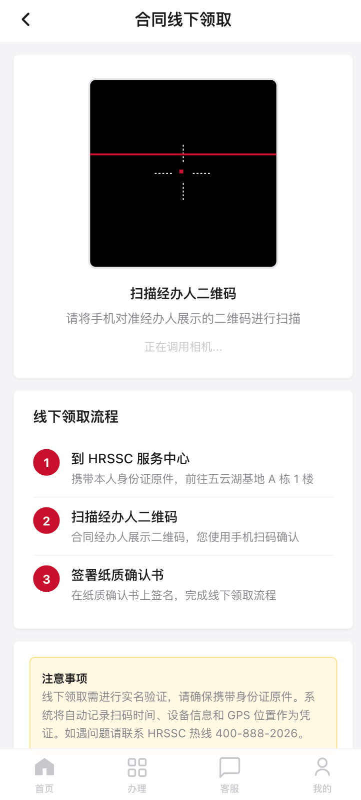 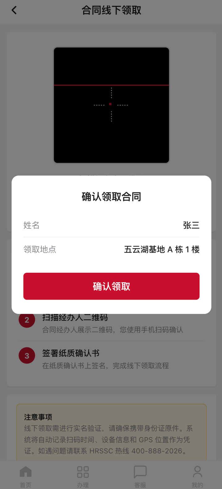 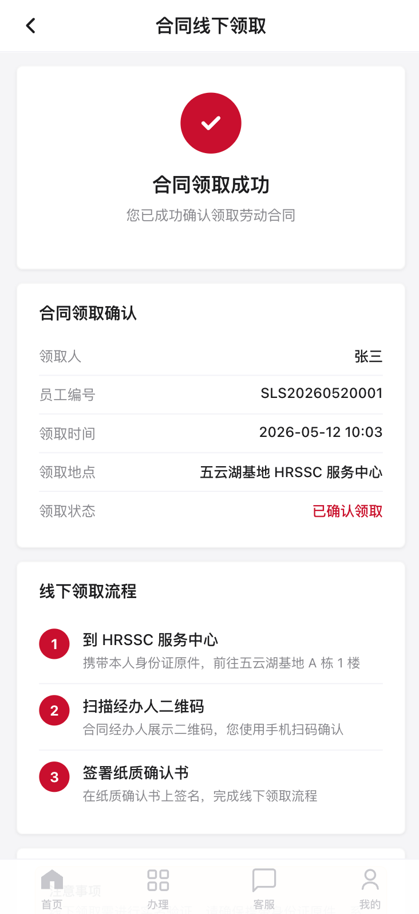

**数据项描述**：

| **数据项名称** | **数据类型** | **数据长度** | **是否必填** | **数据来源** | **备注说明** |
| --- | --- | --- | --- | --- | --- |
| 领取二维码 | 二维码 | — | 是 | 系统生成 | 关联到具体合同工单 |
| 领取确认状态 | 布尔 | — | 是 | 员工扫码 | 已领取/未领取 |
| 领取时间 | 时间戳 | — | 是 | 系统生成 |  |

## 5.7 合同模块

本模块定义合同自动生成方案，基于入职员工的维度信息，自动确定应签合同清单、匹配合同模板、填充文本字段、预览确认，最终通过电子签或纸质签完成合同签署与归档。

合同/协议/承诺书共 13 种，覆盖 2 个基地 × 6 种用工形式；管理维度 9 项，字段约 50 个（去重）；签订规则分两类：A签（员工签字 + 公司用印，7 种）和 B签（仅员工签字，6 种）。

### 5.7.2 确定应签合同清单

根据基地 + 用工形式两个条件，匹配出该员工需要签署的全部合同/协议/承诺书。

_图例：✓ = 须签署 ｜ 留空 = 不适用 ｜ A签 = 员工签字+公司用印 ｜ B签 = 仅员工签字_

**五云湖基地签约清单**：

| # | 合同/协议类型 | 全日制 | 劳务用工 | 实习生 | 非全日制 | 派遣人员 | 外包工 | 签订规则 |
| --- | --- | --- | --- | --- | --- | --- | --- | --- |
| 1 | 劳动合同 | ✓ |  |  |  |  |  | A签 |
| 2 | 劳务协议（决策流） |  | ✓ |  |  |  |  | A签 |
| 3 | 实习协议 |  |  | ✓ |  |  |  | A签 |
| 4 | 非全日制劳动合同 |  |  |  | ✓ |  |  | A签 |
| 5 | 补充协议（竞业） | ✓ |  |  |  |  |  | A签 |
| 6 | 保密协议 | ✓ | ✓ | ✓ | ✓ | ✓ | ✓ | A签 |
| 7 | 廉洁协议 | ✓ | ✓ |  |  |  |  | A签 |
| 8 | 网络与数据安全责任承诺书 | ✓ | ✓ | ✓ | ✓ | ✓ | ✓ | B签 |
| 9 | 个人健康状况承诺书 | ✓ | ✓ | ✓ |  | ✓ | ✓ | B签 |
| 10 | 入职承诺书 | ✓ | ✓ |  | ✓ |  |  | B签 |
| 11 | 无竞业限制申明 | ✓ |  |  |  |  |  | B签 |
| 12 | 无招聘费用返费承诺书 |  |  |  |  |  |  | B签 |

_五云湖·个人健康状况承诺书适用范围为全日制、劳务用工、实习生、派遣人员、外包工，不含非全日制。_

**礼嘉基地签约清单**：

| # | 合同/协议类型 | 全日制 | 劳务用工 | 实习生 | 非全日制 | 派遣人员 | 外包工 | 签订规则 |
| --- | --- | --- | --- | --- | --- | --- | --- | --- |
| 1 | 劳动合同 | ✓ |  |  |  |  |  | A签 |
| 2 | 劳务协议 |  | ✓ |  |  |  |  | A签 |
| 3 | 实习协议 |  |  | ✓ |  |  |  | A签 |
| 4 | 非全日制劳动合同 |  |  |  | ✓ |  |  | A签 |
| 5 | 补充协议（竞业） | ✓ |  |  |  | ✓ |  | A签 |
| 6 | 保密协议 | ✓ | ✓ | ✓ | ✓ | ✓ | ✓ | A签 |
| 7 | 廉洁协议 | ✓ | ✓ | ✓ |  | ✓ |  | A签 |
| 8 | 网络与数据安全责任承诺书 | ✓ | ✓ | ✓ | ✓ | ✓ | ✓ | B签 |
| 9 | 个人健康状况承诺书 |  |  |  |  |  |  | B签 |
| 10 | 入职承诺书 | ✓ | ✓ |  | ✓ |  |  | B签 |
| 11 | 无竞业限制申明 |  |  |  |  |  |  | B签 |
| 12 | 无招聘费用返费承诺书 |  |  |  |  | ✓ |  | B签 |

_两基地签约范围差异：  
\- 补充协议（竞业）：礼嘉基地适用于全日制 + 派遣人员；五云湖基地仅适用于全日制  
\- 廉洁协议：礼嘉基地适用于全日制 + 劳务用工 + 实习生 + 派遣人员；五云湖基地适用于全日制 + 劳务用工_

特殊条件签约：

| # | 合同/协议类型 | 签约条件 | 签订规则 |
| --- | --- | --- | --- |
| S1 | 职业病危害因素告知书 | "合同工单字段「是否职业危害告知书」选择为""是""时生成" | B签 |

### 5.7.3 匹配合同模板

对每种待签合同，根据管理维度组合，匹配到具体的合同模板版本。

**管理维度定义**：

| 编号 | 维度 | 说明 | 数据来源 |
| --- | --- | --- | --- |
| D1 | 管控单位 | 管控该合同的公司/组织 | 入职工单 |
| D2 | 用人单位 | 实际用人主体（当前未使用） | 入职工单 |
| D3 | 用工单位 | 实际用工的业务单元 | 入职工单 |
| D4 | 直间属性 | 直接用工/间接用工（当前未使用） | 入职工单 |
| D5 | 部门 | 员工所属部门 | 入职工单 |
| D6 | 岗位 | 员工任职岗位 | 入职工单 |
| D7 | 用工形式 | 全日制/劳务/实习等 | 入职工单 |
| D8 | 用工形式类别 | 用工形式的细分分类（当前未使用） | 入职工单 |
| D9 | 职级 | 员工职级/职等 | 入职工单 |

**维度匹配矩阵**：

_图例：✓ = 需要校验此维度；— = 无需校验。_

| # | 合同类型 | D1 管控单位 | D3 用工单位 | D7 用工形式 | D9 职级 | 维度数 |
| --- | --- | --- | --- | --- | --- | --- |
| 1 | 劳动合同 | ✓ | ✓ | ✓ | — | 3 |
| 2 | 劳务协议 | ✓ | ✓ | ✓ | — | 3 |
| 3 | 实习协议 | ✓ | ✓ | ✓ | — | 3 |
| 4 | 非全日制劳动合同 | ✓ | ✓ | ✓ | — | 3 |
| 5 | 补充协议（竞业） | ✓ | ✓ | ✓ | ✓ | 4 |
| 6 | 保密协议 | ✓ | ✓ | ✓ | — | 3 |
| 7 | 廉洁协议 | ✓ | ✓ | ✓ | — | 3 |
| 8 | 网络与数据安全责任承诺书 | ✓ | ✓ | ✓ | — | 3 |
| 9 | 个人健康状况承诺书 | ✓ | ✓ | ✓ | — | 3 |
| 10 | 入职承诺书 | ✓ | ✓ | ✓ | — | 3 |
| 11 | 无招聘费用返费承诺书 | ✓ | ✓ | ✓ | — | 3 |
| 12 | 无竞业限制申明 | ✓ | ✓ | ✓ | — | 3 |

_目前仅补充协议（竞业）已实际根据职级区分不同模板，其余合同类型暂无职级区分需求。_

**维度匹配规则分级**：

| 匹配级别 | 维度组合 | 适用合同类型 |
| --- | --- | --- |
| 四维匹配 | 管控单位 + 用工单位 + 用工形式 + 职级 | 补充协议（竞业）（1 种） |
| 三维匹配 | 管控单位 + 用工单位 + 用工形式 | 劳动合同、劳务协议、实习协议、非全日制劳动合同、保密协议、廉洁协议、网络与数据安全责任承诺书、个人健康状况承诺书、入职承诺书、无招聘费用返费承诺书、无竞业限制申明（11 种） |
| 特殊匹配 | 无需维度匹配 | 职业病危害因素告知书（1 种），满足条件时直接使用固定模板 |

**模板技术规范**：

| 项目 | 规范 |
| --- | --- |
| 文件格式 | Microsoft Word（.docx） |
| 占位符语法 | ${fieldName}，字段名与字段配置表的字段 ID 一致 |
| 条件性字段 | 使用 ${#if fieldName}...${/if} 包裹，字段缺失时整段不输出 |
| 列表字段 | 使用 ${#each list}...${/each} 循环渲染 |
| 模板变量 | 保留字：${contractNo}（合同编号）、${generateDate}（生成日期）、${pageBreak}（分页符） |

模板命名规范：**{合同类型代码}\_{自定义名称}\_{版本号}**.docx

_模板名称由合同经办人上传时自行填写，用于人工识别该模板的适用范围；模板的维度匹配由配置表控制，不依赖文件名解析，命名只需保证唯一且可识别即可。_

_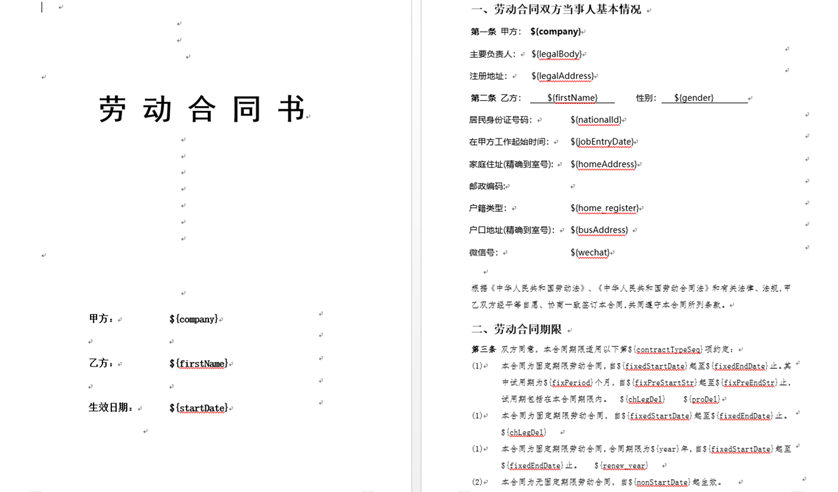_

**合同类型代码表**：

| # | 代码 | 合同类型 | 签订规则 |
| --- | --- | --- | --- |
| 1 | LDHT | 劳动合同 | A签 |
| 2 | LWXY | 劳务协议 | A签 |
| 3 | SXXY | 实习协议 | A签 |
| 4 | FQZHT | 非全日制劳动合同 | A签 |
| 5 | BCXY | 补充协议（竞业） | A签 |
| 6 | BMXY | 保密协议 | A签 |
| 7 | LJXY | 廉洁协议 | A签 |
| 8 | WLAQ | 网络与数据安全责任承诺书 | B签 |
| 9 | JKCN | 个人健康状况承诺书 | B签 |
| 10 | RZCN | 入职承诺书 | B签 |
| 11 | ZYBJ | 职业病危害因素告知书 | B签 |
| 12 | WZPCN | 无招聘费用返费承诺书 | B签 |
| 13 | WJYSM | 无竞业限制申明 | B签 |

**辅助模板类型**（非独立签署合同，用于补充协议内容引用）：

| 代码 | 模板类型 | 用途 |
| --- | --- | --- |
| JYMD1 | 竞业限制名单1 | 供补充协议引用 |
| JYMD2 | 竞业限制名单2 | 供补充协议引用 |

### 5.7.4 填充合同字段

匹配到模板后，根据字段清单从入职工单数据和合同工单数据中提取对应值，填充至合同文本。

**字段数据来源**：

| 数据来源 | 说明 | 典型字段 |
| --- | --- | --- |
| 入职工单 | 员工入职时填写的基础信息 | 姓名、身份证号码、性别、户籍地址、用工单位、岗位、部门等 |
| 合同工单 | 合同签订时的业务配置信息 | 生效日期、合同到期日期、试用期、薪资、签订年限等 |
| 系统计算 | 系统根据规则自动计算 | 合同到期日期、试用期结束时间等 |
| 系统配置 | 按组织/岗位预设的固定配置 | 工时制度（按岗位） |
| 用工单位法人信息配置 | 按用工单位维护的法人信息与单位基本信息 | 法定代表人、经济性质、地址、邮政编码、联系电话 |
| 文本填入 | 合同经办人在合同工单中填入的文本 | 职业病名称、劳保用品、危害因素 |
| 模板选择 | 合同经办人在合同工单中选择指定模板 | 竞业限制名单1、竞业限制名单2 |

**系统计算规则**：

| 计算字段 | 公式 | 说明 |
| --- | --- | --- |
| 合同到期日期 | 生效日期 + 签订年限（年）- 1天 | 精确到日，到期日为非工作日不顺延 |
| 试用期结束时间 | 试用期开始时间 + 试用期（月）- 1天 | 同上 |
| 违约金大写 | 数字金额 → 中文大写 | "如 50000 → 伍万元整，按财务标准格式" |

**试用期上限校验**（依据《劳动合同法》第十九条）：

_同一用人单位与同一劳动者只能约定一次试用期。二次入职员工不适用。_

| 合同期限 / 用工类型 | 法定上限 | 系统校验 |
| --- | --- | --- |
| 非全日制用工 | 不得约定 | 填入时阻断 |
| ＜ 3 个月（含以完成一定工作任务为期限） | 不得约定 | 填入时阻断 |
| 3 个月～1 年（含） | ≤ 1 个月 | 超限阻断 |
| 1 年～3 年（含） | ≤ 2 个月 | 超限阻断 |
| ≥ 3 年 / 无固定期限 | ≤ 6 个月 | 超限阻断 |

**劳动合同期限条款填充规则**：

劳动合同模板中，期限条款为固定文本，三种期限类型并列呈现，系统根据劳动合同期限类型确定生效条款编号，填充至「按照（ ）款执行」的空白处：

| 期限类型 | 条款选择 | 需填充字段 | 判断逻辑 |
| --- | --- | --- | --- |
| 固定期限 | 一 | 起始日期 + 终止日期 | 默认类型，系统根据签订年限自动计算终止日期 |
| 无固定期限 | 二 | 仅起始日期 | 连续订立二次固定期限合同后续签，或连续工作满十年时自动判断 |
| 以完成一定工作任务为期限 | 三 | 起始日期 + 完成工作描述 | 由 HR 在合同工单中手动选择 |

_三种期限条款为固定文本全部输出，非选中条款的日期空白处留空，仅选中条款的日期字段由系统填充。_

各合同类型字段清单：

1\. **劳动合同**（23 个字段）：

| 分类 | 字段 | 数据来源 |
| --- | --- | --- |
| 公司信息 | 用工单位 | 入职工单 |
|  | 经济性质 | 用工单位法人信息配置 |
|  | 法定代表人 | 用工单位法人信息配置 |
|  | 地址 | 用工单位法人信息配置 |
|  | 邮政编码（公司） | 用工单位法人信息配置 |
|  | 联系电话 | 用工单位法人信息配置 |
| 合同核心 | 生效日期 | 合同工单 |
|  | 合同到期日期 | 系统计算 |
|  | 岗位 | 入职工单 |
|  | 工时制度 | 系统配置（按岗位） |
|  | 劳动合同期限类型 | 合同工单 |
|  | 完成工作描述 | 合同经办人填入 |
| 薪资期限 | 试用期开始时间 | 合同工单 |
|  | 试用期结束时间 | 系统计算 |
|  | 试用期月工资 | 合同工单 |
|  | 转正月工资 | 合同工单 |
| 个人信息 | 姓名（签章） | 入职工单 |
|  | 身份证号码 | 入职工单 |
|  | 性别 | 入职工单 |
|  | 户籍地址 | 入职工单 |
|  | 经常居住地 | 入职工单 |
|  | 邮政编码（个人） | 入职工单 |
|  | 电话 | 入职工单 |

2\. **劳务协议**（12 个字段）：

| 分类 | 字段 | 数据来源 |
| --- | --- | --- |
| 公司信息 | 用工单位 | 入职工单 |
| 合同核心 | 生效日期 | 合同工单 |
|  | 合同到期日期 | 系统计算 |
|  | 岗位 | 入职工单 |
| 薪资期限 | 试用期开始时间 | 合同工单 |
|  | 试用期结束时间 | 系统计算 |
|  | 试用期月工资 | 合同工单 |
|  | 转正月工资 | 合同工单 |
| 个人信息 | 姓名（签章） | 入职工单 |
|  | 身份证号码 | 入职工单 |
|  | 电话 | 入职工单 |
| 其他 | 紧急联系人 | 入职工单 |

3\. **实习协议**（8 个字段）：

| 分类 | 字段 | 数据来源 |
| --- | --- | --- |
| 公司信息 | 用工单位 | 入职工单 |
| 合同核心 | 生效日期 | 合同工单 |
| 学校信息 | 大学名 | 入职工单 |
|  | 学生届数 | 入职工单 |
|  | 学历层次 | 入职工单 |
| 实习信息 | 实习工资 | 合同工单（部分场景） |
| 个人信息 | 姓名（签章） | 入职工单 |
|  | 身份证号码 | 入职工单（部分场景） |

1.  **非全日制劳动合同**（待确认）：模板尚未收集到位，字段清单待模板确认后补充。匹配方式按简化三维匹配（管控单位 + 用工单位 + 用工形式）设计。

5\. **补充协议/竞业限制协议**（5 个字段）：

| 分类 | 字段 | 数据来源 |
| --- | --- | --- |
| 公司信息 | 用工单位 | 入职工单 |
| 违约条款 | 补充协议违约金 | 合同工单 |
|  | 违约金大写 | 系统计算 |
| 竞业条款 | 竞业限制名单1 | 模板选择（合同经办人在合同工单中选择指定模板） |
|  | 竞业限制名单2 | 模板选择（合同经办人在合同工单中选择指定模板） |

6\. **保密协议**（11 个字段）：

| 分类 | 字段 | 数据来源 |
| --- | --- | --- |
| 公司信息 | 用工单位 | 入职工单 |
|  | 法定代表人 | 用工单位法人信息配置 |
| 保密条款 | 保密协议期限 | 合同工单 |
|  | 保密协议违约金 | 合同工单 |
|  | 违约金大写 | 系统计算 |
| 签署信息 | 签订时间 | 合同工单（部分场景） |
|  | 签订地点 | 合同工单（部分场景） |
| 个人信息 | 姓名（签章） | 入职工单（部分场景） |
|  | 身份证号码 | 入职工单（部分场景） |
|  | 经常居住地 | 入职工单（部分场景） |
|  | 电话 | 入职工单（部分场景） |

7\. **廉洁协议**（5 个字段）：

| 分类 | 字段 | 数据来源 |
| --- | --- | --- |
| 公司信息 | 用工单位 | 入职工单 |
|  | 法定代表人 | 用工单位法人信息配置 |
|  | 派遣公司名称 | 入职工单 |
| 个人信息 | 姓名（签章） | 入职工单 |
|  | 身份证号码 | 入职工单 |

1.  **网络与数据安全责任承诺书**（2 个字段）：

用工单位（入职工单）、部门（入职工单）

1.  **个人健康状况承诺书**（2 个字段）：

用工单位（入职工单）、岗位（入职工单）

1.  **入职承诺书**（5 个字段）：

姓名（首部）、用工单位、岗位、姓名（签章）、身份证号码（均来自入职工单）

11\. **职业病危害因素告知书**（6 个字段）：

_仅当合同工单字段「是否职业危害告知书」选择为"是"时才生成此告知书。_

| 字段 | 数据来源 |
| --- | --- |
| 用工单位 | 入职工单 |
| 部门 | 入职工单 |
| 岗位 | 入职工单 |
| 职业病名称 | 合同经办人填入（合同工单 #60） |
| 劳保用品 | 合同经办人填入（合同工单 #61） |
| 危害因素 | 合同经办人填入（合同工单 #63） |

1.  **无招聘费用返费承诺书**（2 个字段）：

用工单位（入职工单）、岗位（入职工单）

1.  **无竞业限制申明**（4 个字段）：

用工单位、部门、姓名（签章）、身份证号码（均来自入职工单）

### 5.7.5 生成预览与确认

合同文本生成后，进入待确认状态。HR 需预览合同内容，确认信息无误后方可推送签署。

预览确认规则：

| 规则 | 说明 |
| --- | --- |
| 预览格式 | PDF 格式在线预览（不生成可下载文件） |
| 修改范围 | 仅允许修改合同工单字段（竞业限制名单，是否职业危害告知书等），入职工单字段不可修改 |
| 批量确认 | 同一员工的全部合同可批量确认，也可逐份确认 |
| 确认权限 | 合同经办人 |

### 5.7.6 合同签署与归档

合同确认后，根据签署方式进入签署流程。支持线上电子签和线下纸质签双通道。

**签订规则分类**：

\- A签（员工签字 + 公司用印，一式两份，具备双边法律效力）：劳动合同、劳务协议、实习协议、非全日制劳动合同、补充协议（竞业）、保密协议、廉洁协议

\- B签（仅员工签字，一份即可，单方承诺性质）：网络与数据安全责任承诺书、个人健康状况承诺书、入职承诺书、无招聘费用返费承诺书、无竞业限制申明、职业病危害因素告知书

签署方式与流程：

| **签署方式** | **流程** | **说明** |
| --- | --- | --- |
| 线上签署（默认） | 合同确认 → 推送至 E签宝平台 → 员工移动端电子签署（飞书通知推送） → A签：公司电子章用印 / B签：跳过用印 → 签署完成 → 自动回传签署凭证 → 归档 | 集成 E签宝 |
| 线下签署（备选） | 合同确认 → 打印纸质合同 → 员工现场签字 → A签：发起 OA 用印申请 → 用印完成 / B签：跳过用印 → 扫描上传 → 归档 | 员工无法使用电子签时 |

**签署方式选择规则**：

| **场景** | **推荐方式** | **说明** |
| --- | --- | --- |
| 常规入职 | 线上（电子签） | 默认方式 |
| 员工不会操作 | 线上（电子签） | HR 培训电子签操作步骤 |
| 员工无智能手机 | 线下（纸质签） | HR 在工单中打印合同 |
| 电子签平台不可用 | 线下（纸质签） | HR 在工单中打印合同 |
| 网络异常/系统故障 | 线下（纸质签） | 使用空白合同手工填写 |

### 5.7.7 合同生成引擎设计

**模板匹配流程（两步匹配）**：

1\. **维度匹配**：根据入职工单中的维度值（管控单位、用工单位、用工形式等），在维度映射表中找到匹配的映射记录，获取模板 ID

2\. **模板验证**：根据模板 ID 查询模板记录，验证 生效日期 ≤ 当前日期 < 失效日期，确认模板当前可用

**维度匹配优先级（当多个维度映射记录匹配到相同维度时）**：

1\. **完全匹配**：所有维度值完全一致 → 优先使用

2\. **通配匹配**：存在通配维度（如"\*"） → 降级使用

3\. **默认模板**：无任何匹配 → 使用默认模板

异常处理：

| **异常场景** | **处理方式** |
| --- | --- |
| 用工单位未配置法人信息 | "阻断生成，提示""该用工单位尚未维护法人信息，请先配置""" |
| 维度映射无匹配记录 | "阻断生成，提示""该维度组合未配置模板映射，请检查维度映射表""" |
| 映射的模板已失效 | "阻断生成，提示""映射的模板已失效（失效日期：{日期}），请更新维度映射""" |
| 必填字段缺失 | 阻断生成，提示补录 |
| 部分场景字段缺失 | 预览时发现为空，自行补录 |
| 职业病告知书已选择但危害因素未填 | 生成告知书，相关字段留空，提示合同经办人补充填入 |
| 试用期超法定上限 | 阻断生成，提示 HR 修正试用期或合同期限 |
| E签宝推送失败 | 自动重试（最多 3 次，间隔 30 秒）；仍失败提示同步电子签失败，合同经办人可手工推送 |
| E签宝签署回调超时（>24h） | 系统发送催办通知至员工和入职经办人；>72h 升级通知合同经办人 |

合同编号生成规则：

编号格式：**{管控单位简称}-{合同类型代码}-{年份}-{流水号}**

示例：SLYS-LDHT-2026-000001

| 组成部分 | 说明 | 示例 |
| --- | --- | --- |
| 管控单位简称 | 管控单位缩写，2-4 位大写字母 | JTZB（集团总部） |
| 合同类型代码 | 参见合同类型代码表 | LDHT（劳动合同） |
| 年份 | 合同生成当年的四位年份 | 2026 |
| 流水号 | 6 位数字，按「管控单位 + 合同类型 + 年份」分段递增 | 000001 |

\- 流水号按 管控单位 + 合同类型 + 年份 组合独立递增，全年内不归零

\- 编号在合同文本填充时生成，不占用空号

\- 合同作废后编号不回收、不重用

### 5.7.8 合同模板管理

合同模板采用模板表与维度映射表分离的设计：合同模板表管理模板文件本身（上传、版本、生效/失效日期），维度映射表管理维度组合与模板 ID 的映射关系。同一模板可被多个维度组合复用。

模板生效判断机制：

模板没有"有效/无效"等状态字段，系统通过生效日期和失效日期动态判断：

| 时间阶段 | 日期条件 | 是否参与合同生成 | 说明 |
| --- | --- | --- | --- |
| 未生效 | 当前日期 < 生效日期 | ❌ | 等待生效日期到达 |
| 生效中 | 生效日期 ≤ 当前日期 < 失效日期 | ✓ | 系统匹配模板时自动筛选 |
| 已失效 | 当前日期 ≥ 失效日期 | ❌ | 保留在系统中，供历史合同回溯查询 |

\- 上传新模板时：失效日期默认为 9999-12-31，表示永久生效

\- 上传新版本时：系统自动将同名旧模板的失效日期设为新模板生效日期 - 1 天

\- 失效模板保留在系统中，供历史合同回溯查询

模板新增/上传流程：

| 步骤 | 操作 | 说明 |
| --- | --- | --- |
| 1 | 选择合同类型 | 从 13 种合同类型 + 2 种辅助模板类型中选择 |
| 2 | 上传模板文件 | 上传 .docx 格式文件 |
| 3 | 填写模板名称 | 同一合同类型下名称唯一 |
| 4 | 设定生效日期 | 选择该模板开始生效的日期 |
| 5 | 提交保存 | 系统自动校验后保存，失效日期默认 9999-12-31 |

上传校验规则：

| 校验项 | 规则 | 失败处理 |
| --- | --- | --- |
| 文件格式 | 必须为 .docx | "阻断上传，提示""仅支持 .docx 格式""" |
| 文件大小 | ≤ 10MB | "阻断上传，提示""文件大小超过限制""" |
| 占位符合规性 | ${fieldName} 格式是否合法，字段名是否在字段定义表中存在 | 阻断保存，列出非法占位符及未映射字段名 |
| 日期合理性 | 生效日期 < 失效日期 | 阻断保存 |
| 模板名称唯一性 | 同一合同类型下不可重复 | 阻断保存 |

模板版本管理：

| 规则 | 说明 |
| --- | --- |
| 日期驱动生效 | 合同生成时查询 生效日期 ≤ 当前日期 < 失效日期 的模板进行匹配，无需状态切换 |
| 模板名称标识 | 同一合同类型下，相同模板名称代表同一系列的不同版本 |
| 失效日期默认值 | 新上传模板的失效日期默认为 9999-12-31，表示永久生效 |
| 新版本自动衔接 | 上传新版本时，系统自动将同名旧模板的失效日期设为新模板生效日期 - 1 天 |
| 维度映射自动更新 | 新版本保存后，维度映射表中所有指向旧模板 ID 的记录自动更新为新模板 ID |
| 版本号自动递增 | 系统按模板名称自动递增版本号（v1 → v2 → v3...），不支持手动修改 |
| 失效模板保留 | 失效模板不参与新合同生成，但保留供历史合同回溯查询 |
| 日期修改规则 | 未生效模板允许修改生效日期和模板名称；已生效模板仅允许修改失效日期 |

模板预览与校验：

| 预览类型 | 说明 |
| --- | --- |
| 模板内容预览 | 直接查看 .docx 模板文件的原始内容（渲染后） |
| 占位符清单 | 系统自动解析模板文件，列出所有占位符及其对应的字段定义 |
| 试填充预览 | 使用测试数据或指定入职工单数据，填充占位符后生成预览 PDF |

模板管理权限：

| 操作 | 合同经办人 | 合同COE |
| --- | --- | --- |
| 查看模板列表 | ✓ | ✓ |
| 上传新增模板 | ❌ | ✓ |
| 修改未生效模板 | ❌ | ✓ |
| 替换模板文件（仅未生效） | ❌ | ✓ |
| 修改已生效模板的失效日期 | ❌ | ✓ |
| 删除模板（仅未生效） | ❌ | ✓ |
| 下载模板文件 | ❌ | ✓ |
| 查看版本历史 | ✓ | ✓ |
| 新增/修改维度映射 | ❌ | ✓ |
| 删除维度映射 | ❌ | ✓ |

### 5.7.9 数据模型概要

合同模块涉及 7 张配置表

| # | 配置表名称 | 说明 |
| --- | --- | --- |
| 1 | 合同协议类型表 | 合同协议类型、生成规则、签订规则定义 |
| 2 | 应签合同清单配置表 | 基地 × 管控单位 × 用工类型 → 应签合同清单 |
| 3 | 合同模板管理表 | 模板文件、版本、生效/失效日期（不含维度信息） |
| 4 | 合同模板维度映射表 | 9 个管理维度组合 → 模板 ID 的映射关系 |
| 5 | 合同字段定义表 | 各合同类型的字段 ID、名称、数据来源、必填属性 |
| 6 | 用工单位法人信息配置表 | 用工单位法人信息与单位基本信息 |
| 7 | 合同工单默认值配置表 | 管控单位 × 用工单位的薪资、违约金等合同工单默认值配置 |

**表1：合同协议类型表**

定义所有合同/协议的类型、生成规则与签订规则，作为其他配置表的基础数据。

| 数据项名称 | 数据类型 | 数据长度 | 是否必填 | 数据来源 | 备注说明 |
| --- | --- | --- | --- | --- | --- |
| 合同类型 | 文本 | 50 | 是 | 手工录入 | 合同/协议名称，共 13 种 + 2 种辅助模板（竞业限制名单1/2） |
| 生成规则 | 枚举 | 20 | 是 | 手工录入 | 维度匹配（按维度组合匹配模板）/ 选项值判断（如职业病告知书由合同工单字段控制） |
| 签订规则 | 枚举 | 10 | 是 | 手工录入 | A签（员工签字+公司用印）/ B签（仅员工签字）/ 辅助（非独立签署） |

**表2：应签合同清单配置表**

本表维护基地 × 管控单位 × 用工类型组合下需签署的合同清单，系统根据员工的基地、管控单位、用工类型匹配出应签合同列表。

| 数据项名称 | 数据类型 | 数据长度 | 是否必填 | 数据来源 | 备注说明 |
| --- | --- | --- | --- | --- | --- |
| 基地 | 枚举 | 20 | 是 | 手工录入 | 五云湖基地 / 礼嘉基地 |
| 管控单位 | 文本 | 50 | 是 | 手工录入 | 管控单位名称，\* 表示所有管控单位均适用 |
| 用工类型 | 枚举 | 20 | 是 | 关联用工形式 | 全日制 / 劳务用工 / 实习生 / 非全日制 / 派遣人员 / 外包工 |
| 合同类型 | 枚举 | 50 | 是 | 关联合同协议类型表 | 需签署的合同/协议名称 |

**表3：合同模板管理表**

本表仅管理模板文件本身及其版本、生效/失效日期，不包含管理维度信息。管理维度通过独立的维度映射表（表4）关联到模板 ID。

| 数据项名称 | 数据类型 | 数据长度 | 是否必填 | 数据来源 | 备注说明 |
| --- | --- | --- | --- | --- | --- |
| 模板 ID | 字符串 | 32 | 是 | 系统自动生成 | 唯一标识 |
| 合同类型 | 枚举 | 50 | 是 | 关联合同协议类型表 | 关联 13 种合同类型 + 2 种辅助模板类型（竞业限制名单1/2） |
| 模板名称 | 文本 | 100 | 是 | 手工录入 | "同一合同类型下唯一，用于标识模板用途（如""五云湖全日制劳动合同""）" |
| 模板文件 | 文件路径 | 255 | 是 | 上传 | .docx 模板文件路径 |
| 版本号 | 字符串 | 10 | 是 | 系统自动生成 | 按模板名称自动递增，格式 v{N}（如 v1、v2） |
| 生效日期 | 日期 | — | 是 | 手工录入 | 该版本开始使用的日期 |
| 失效日期 | 日期 | — | 是 | 系统默认 | 该版本停止使用的日期，默认 9999-12-31（永久生效） |
| 创建人 | 文本 | 50 | 是 | 系统自动 | 首次上传该模板的合同经办人 |
| 创建时间 | 时间戳 | — | 是 | 系统自动 | 首次上传的时间戳 |
| 修改人 | 文本 | 50 | — | 系统自动 | 最近一次修改该模板的合同经办人 |
| 修改时间 | 时间戳 | — | — | 系统自动 | 最近一次修改的时间戳 |

_模板生效判断规则  
\- 模板没有"有效/无效"状态字段，系统通过生效日期和失效日期判断模板是否可用：生效日期 ≤ 当前日期 < 失效日期  
\- 失效日期默认为 9999-12-31，表示永久生效；上传新版本时，系统自动将同名旧模板的失效日期设为新模板生效日期 - 1 天  
\- 同一合同类型 + 同一模板名称的日期范围不可重叠，系统保存时自动校验，重叠则阻断并提示  
\- 失效日期已过（当前日期 ≥ 失效日期）的模板不参与合同生成，但保留用于历史合同回溯查询  
\- 辅助模板类型（竞业限制名单1/2）不参与签约流程，仅作为补充协议的内容引用源_

**表4：合同模板维度映射表**

本表管理 9 个维度组合与模板 ID 的映射关系，与合同模板表（表3）分离。一个模板可被多个维度组合复用，调整映射不影响模板本身。

| 数据项名称 | 数据类型 | 数据长度 | 是否必填 | 数据来源 | 备注说明 |
| --- | --- | --- | --- | --- | --- |
| 映射 ID | 字符串 | 32 | 是 | 系统自动生成 | 唯一标识 |
| 合同类型 | 枚举 | 50 | 是 | 关联合同协议类型表 | 关联 13 种合同类型 + 2 种辅助模板类型 |
| D1 管控单位 | 文本 | 50 | 是 | 手工录入 | 维度值，\* 表示通配 |
| D2 用人单位 | 文本 | 50 | 否 | 手工录入 | 维度值，\* 表示通配（当前未使用，预留扩展） |
| D3 用工单位 | 文本 | 50 | 是 | 手工录入 | 维度值，\* 表示通配 |
| D4 直间属性 | 文本 | 50 | 否 | 手工录入 | 维度值，\* 表示通配（当前未使用，预留扩展） |
| D5 部门 | 文本 | 50 | 否 | 手工录入 | 维度值，\* 表示通配 |
| D6 岗位 | 文本 | 50 | 否 | 手工录入 | 维度值，\* 表示通配 |
| D7 用工形式 | 文本 | 50 | 是 | 手工录入 | 维度值，\* 表示通配 |
| D8 用工形式类别 | 文本 | 50 | 否 | 手工录入 | 维度值，\* 表示通配（当前未使用，预留扩展） |
| D9 职级 | 文本 | 50 | 否 | 手工录入 | 维度值，\* 表示通配 |
| 模板 ID | 字符串 | 32 | 是 | 关联合同模板表（表3） | FK，指向该维度组合使用的模板 |
| 创建人 | 文本 | 50 | 是 | 系统自动 | 首次创建映射的合同经办人 |
| 创建时间 | 时间戳 | — | 是 | 系统自动 | 首次创建的时间戳 |
| 修改人 | 文本 | 50 | — | 系统自动 | 最近一次修改的合同经办人 |
| 修改时间 | 时间戳 | — | — | 系统自动 | 最近一次修改的时间戳 |

_维度映射规则  
\- 9 个维度全部存储在维度映射表中，维度值为 \* 时表示通配（即不参与匹配），值为空表示尚未配置；当前未使用的维度（D2、D4、D5、D6、D8）预留为空，便于后期业务扩展  
\- 同一合同类型下，维度组合不可重复（即 9 个维度值完全相同的映射记录只能有一条）  
\- 模板版本替换时，系统自动更新所有指向旧模板 ID 的映射记录为新模板 ID  
\- 映射表中指向的模板 ID 若已失效（失效日期已过），合同生成时将提示"映射的模板已失效，请更新维度映射"  
\- 维度匹配优先级：完全匹配 > 通配匹配 > 默认模板_

**表5：合同字段定义表**

字段配置为字段定义表，以支持同一字段在不同合同类型中有不同的必填属性。

| 数据项名称 | 数据类型 | 数据长度 | 是否必填 | 数据来源 | 备注说明 |
| --- | --- | --- | --- | --- | --- |
| 合同类型 | 枚举 | 50 | 是 | 关联合同协议类型表 | 关联 13 种合同类型 |
| 字段 ID | 字符串 | 50 | 是 | 系统自动生成 | 唯一标识，与模板占位符 ${fieldName} 对应 |
| 字段名称 | 文本 | 100 | 是 | 手工录入 | "如""用工单位""、""姓名（签章）""" |
| 数据来源类型 | 枚举 | 30 | 是 | 手工录入 | 入职工单 / 合同工单 / 系统计算 / 系统配置 / 用工单位法人信息配置 / 文本填入 / 模板选择 |
| 数据来源字段 | 字符串 | 100 | 否 | 手工录入 | 对应源系统字段映射 |
| 是否必填 | 布尔 | — | 是 | 手工录入 | 是 / 否 |

**表6：用工单位法人信息配置表**

本表维护使用电子签功能的各用工单位对应的法人信息与单位基本信息，用于合同生成时自动填充法人相关字段（经济性质、法定代表人、地址、邮政编码、联系电话）。每个用工单位对应一条有效配置记录。

| 数据项名称 | 数据类型 | 数据长度 | 是否必填 | 数据来源 | 备注说明 |
| --- | --- | --- | --- | --- | --- |
| 配置 ID | 字符串 | 32 | 是 | 系统自动生成 | 唯一标识，主键 |
| 用工单位 | 字符串 | 50 | 是 | 关联组织架构 | 关联用工单位，每个用工单位仅一条有效配置 |
| 单位全称 | 文本 | 200 | 是 | 手工录入 | 合同中显示的用工单位全称 |
| 经济性质 | 文本 | 50 | 否 | 手工录入 | "如""有限责任公司""、""股份有限公司""等" |
| 法定代表人 | 文本 | 50 | 否 | 手工录入 | 法人姓名 |
| 地址 | 文本 | 200 | 否 | 手工录入 | 注册/办公地址（合同中填写的甲方地址） |
| 邮政编码 | 字符串 | 6 | 否 | 手工录入 | 单位邮政编码 |
| 联系电话 | 字符串 | 20 | 否 | 手工录入 | 单位联系电话 |
| 状态 | 枚举 | 10 | 是 | 手工录入 | 有效 / 无效，无效配置不参与合同生成 |
| 创建人 | 文本 | 50 | — | 系统自动 | 首次录入的合同经办人 |
| 创建时间 | 时间戳 | — | — | 系统自动 | 首次录入时间 |
| 修改人 | 文本 | 50 | — | 系统自动 | 最近修改的合同经办人 |
| 修改时间 | 时间戳 | — | — | 系统自动 | 最近修改时间 |

_维护机制  
\- 维护权限：合同经办人，根据办公室提供的营业执照等材料录入  
\- 唯一性约束：每个用工单位仅允许一条"有效"配置  
\- 更新策略：修改仅影响新合同，历史合同不受影响  
\- 异常处理：用工单位未配置 → 阻断生成；配置字段为空 → 留空不阻断_

**表7：合同工单默认值配置表**

本表维护管控单位 × 用工单位组合下的合同工单默认值，用于合同生成时自动填充薪资、违约金等字段。合同经办人在创建合同工单时，系统根据所选管控单位和用工单位自动带入默认值，经办人可修改。

| 数据项名称 | 数据类型 | 数据长度 | 是否必填 | 数据来源 | 备注说明 |  |
| --- | --- | --- | --- | --- | --- | --- |
| 管控单位 ID | 字符串 | 32 | 是 | 关联组织架构 | 关联管控单位 |  |
| 用工单位 ID | 字符串 | 32 | 是 | 关联组织架构 | 关联用工单位 |  |
| 管控单位 | 文本 | 100 | 是 | 关联组织架构 | 管控单位名称 |  |
| 用工单位 | 文本 | 100 | 是 | 关联组织架构 | 用工单位名称 |  |
| 试用期月工资 | 数值 | "12 | 2" | 否 | 手工录入 | 该组合下的试用期月工资默认值 |
| 转正月工资 | 数值 | "12 | 2" | 否 | 手工录入 | 该组合下的转正月工资默认值 |
| 实习工资 | 数值 | "12 | 2" | 否 | 手工录入 | 该组合下的实习工资默认值（实习协议适用） |
| 补充协议违约金金额 | 数值 | "12 | 2" | 否 | 手工录入 | 补充协议（竞业）违约金默认值 |
| 保密协议违约金规则 | 文本 | 200 | 否 | 手工录入 | 保密协议违约金计算规则或金额 |  |

## 5.8 接口需求

### 5.8.1 接口清单

I010 — **工单创建与通知**（3 个接口）

创建入职工单，并通过邮件和短信通知待入职人员。

| 编号 | 接口功能 | 消费方 | 提供方 | 备注 |
| --- | --- | --- | --- | --- |
| I010-01-01 创建工单 | 工单记录新建、工单记录上传图片文件 | I9、OA | 工单系统 | 先调用创建记录接口；如有图片和附件，再调用上传接口 |
| I010-03-01 发送入职邮件 | 企业邮箱发送入职邮件给待入职人员 | 工单系统 | 邮件系统 | — |
| I010-04-01 发送入职短信 | 发送入职短信给待入职人员 | 工单系统 | 短信平台 | 需要澄清如何使用短信模板 |

I020 — **移动端交互**（8 个接口）

待入职员工通过移动端完成登录、隐私签署、资料提交、承诺签署、在线客服、AI审核等操作。

| 编号 | 接口功能 | 消费方 | 提供方 | 备注 |
| --- | --- | --- | --- | --- |
| I020-01-01 登录移动端 | 工单记录查询、短信记录保存 | 移动端 | 工单系统 | 根据手机号或员工唯一标识查询入职工单 |
| I020-02-01 签订隐私声明 | 调用 DPO 接口，确定是否显示与显示内容 | 移动端 | DPO | DPO 开发中 |
| I020-02-01 签订隐私声明 | 隐私声明阅读状态写入工单 | 移动端 | 工单系统 | — |
| I020-04-01 提交入职资料 | 员工信息写入工单 | 移动端 | 工单系统 | — |
| I020-05-01 真实性承诺签署 | 签署状态写入工单 | 移动端 | 工单系统 | — |
| I020-06-01 在线客服 | 提供在线客服接入文档 | 移动端 | 工单系统 | — |
| I020-07-01 入职信息 AI 审核 | 数据推送 AI 审核 | 移动端 | AI 审核模块 | POST 接口，在接口路径上拼接工单记录唯一标识，body 传递常规字段信息 |
| I020-07-01 入职信息 AI 审核 | AI 审核结果写入工单 | AI 审核模块 | 工单系统 | 慧博调用接口，获取工单详细信息 |

I030 — 工单审核（8 个接口）

入职工单审核流程，包括审核不通过通知、审核通过后自动创建员工号、数据同步、合同工单创建与审核。

| 编号 | 接口功能 | 消费方 | 提供方 | 备注 |
| --- | --- | --- | --- | --- |
| I030-01-01 入职工单审核 | 发送审核不通过通知给待入职员工 | 工单系统 | 短信平台 | 短信中包含移动端在线客服跳转 URL 链接 |
| I030-01-01 入职工单审核 | 在线客服了解工单审核情况 | 移动端 | 工单系统 | 客服系统查询工单系统，获取入职资料审核结果 |
| I030-02-01 入职工单审核通过 | 创建员工号接口 | 工单系统 | I9 | "系统自动调用 I9 接口生成员工号，存入工单""员工工号""字段" |
| I030-02-01 入职工单审核通过 | 员工数据同步 SAP 接口 | 工单系统 | SF | 调用 SF/HCM 接口生成员工号，需传入中文全名、地址、电话、紧急联系人、学历等字段 |
| I030-02-01 入职工单审核通过 | 访客预约应用对接接口 | 工单系统 | 访客系统 | 信息推送至访客预约应用，自动发送短信提醒待入职员工 |
| I030-03-01 合同工单创建 | 对接飞书机器人消息接口 | 工单系统 | 飞书 | 通过 IM 给合同审核人发送待审核消息 |
| I030-04-01 合同工单审核通过 | 合同信息同步 | 工单系统 | 合同管理模块 | 合同工单信息推送 |
| I030-04-01 合同工单审核通过 | 工单上传文件接口 | 合同管理模块 | 工单系统 | — |
| I030-04-01 合同工单审核通过 | 合同文件同步到电子签 | 合同管理模块 | 电子签 | 合同文件推送给电子签，完成对接电子工作 |

I060 — 二维码签到（2 个接口）

入职当天通过飞书扫码完成签到。

| 编号 | 接口功能 | 消费方 | 提供方 | 备注 |
| --- | --- | --- | --- | --- |
| I060-01-01 二维码签到 | 飞书扫码二维码跳转移动端进行签到确认 | 飞书 | 移动端 | — |
| I060-01-02 二维码签到工单 | 签到状态更新到工单 | 移动端 | 工单系统 | — |

I070 — 线上合同推送（1 个接口）

推送签字通知到待入职员工。

| 编号 | 接口功能 | 消费方 | 提供方 | 备注 |
| --- | --- | --- | --- | --- |
| I070-03-01 线上合同推送 | 推送签字通知到待入职员工 | 工单系统 | 飞书 | — |

I080 — 电子签集成（3 个接口）

员工通过移动端完成电子签签署，状态回写工单。

| 编号 | 接口功能 | 消费方 | 提供方 | 备注 |
| --- | --- | --- | --- | --- |
| I080-01-01 登录移动端 | 工单记录查询、短信记录保存 | 移动端 | 工单系统 | — |
| I080-02-01 集成电子签 | 跳转电子签进行员工签字 | 移动端 | 电子签 | — |
| I080-03-01 员工电子签完成 | 员工签字状态写入工单 | 移动端 | 工单系统 | — |

I090 — 报到通知与满意度评价（3 个接口）

入职报到部门通知及入职满意度评价。

| 编号 | 接口功能 | 消费方 | 提供方 | 备注 |
| --- | --- | --- | --- | --- |
| I090-01-01 发送部门报到通知 | 飞书机器人消息对接 | 工单系统 | 飞书 | 选择对应 HRBP 并确认后，系统自动发送飞书消息 |
| I090-02-01 入职满意度评价（飞书） | 发送员工入职欢迎，调整移动端进行入职满意度评价 | 工单系统 | 飞书 | — |
| I090-02-02 入职满意度评价（移动端） | 满意度评价接口 | 移动端 | 工单系统 | 把满意度信息更新到对应工单记录中 |

I110 — 合同用印（1 个接口）

调用电子签用印接口完成合同用印。

| 编号 | 接口功能 | 消费方 | 提供方 | 备注 |
| --- | --- | --- | --- | --- |
| I110-01-01 合同用印 | 调用电子签用印接口 | 工单系统 | 电子签 | 调用慧博封装接口，获取对应参数 + 工单链接，调用电子签接口 |

I120 — 合同领取（2 个接口）

通过飞书和移动端通知员工领取合同。

| 编号 | 接口功能 | 消费方 | 提供方 | 备注 |
| --- | --- | --- | --- | --- |
| I120-01-01 合同领取（飞书） | 发送合同领取通知给到员工 | 工单系统 | 飞书 | — |
| I120-01-02 合同领取（移动端） | 合同记录查询和更新接口 | 移动端 | 工单系统 | "消息 API：发送合同领取通知及跳转链接；工单 API（读取）：读取合同领取状态；工单 API（写入）：记录员工点击""收到""的确认动作" |

I980 — 终止提醒（1 个接口）

发出终止提醒到招聘经办人。

| 编号 | 接口功能 | 消费方 | 提供方 | 备注 |
| --- | --- | --- | --- | --- |
| I980-01-01 发出终止提醒 | 对接飞书机器人消息接口 | 工单系统 | 飞书 | 系统发飞书提醒 |

I000 — 其他集成（2 个接口）

AD域集成与主数据同步。

| 编号 | 接口功能 | 消费方 | 提供方 | 备注 |
| --- | --- | --- | --- | --- |
| I000-01-01 AD 域集成 | 接入企业账号，实现单点登录 | 工单系统 | IAM | 定时拉取 |
| I000-01-02 主数据同步 | 员工数据同步到工单系统 | 工单系统 | HCM | 定时拉取 |

### 5.8.2 接口统计

| 统计项 | 数量 |
| --- | --- |
| 功能模块 | 13 个 |
| 接口总数 | 35 个 |

接口提供方汇总：

| 提供方 | 接口数量 | 说明 |
| --- | --- | --- |
| 工单系统 | 15 | 核心系统，工单增删改查、状态写入 |
| 飞书 | 7 | 机器人消息通知、扫码签到 |
| 电子签 | 4 | 合同签署、用印 |
| 合同管理模块 | 3 | 合同信息管理 |
| I9 | 1 | 员工号生成 |
| SF（SAP） | 1 | 员工数据同步 |
| 邮件系统 | 1 | 入职邮件发送 |
| 短信平台 | 2 | 入职短信、审核通知 |
| DPO | 1 | 隐私声明 |
| AI 审核模块 | 1 | 入职资料 AI 审核 |
| 访客系统 | 1 | 访客预约 |
| HCM | 1 | 主数据同步 |
| IAM | 1 | AD 域（已取消） |

# 6 主数据

本模块定义入职系统核心业务流程涉及的全部数据实体，涵盖入职办理、合同签订两大业务的数据结构，以及跨表单的字段关联关系。

_详见 主数据清单_

### 6.1 数据实体概览

入职系统共涉及 10 个数据实体，以入职工单为核心，合同工单为关联工单，7 个入职工单子表为明细数据：

| 序号 | 数据实体 | API 名称 | 数据来源 | 字段数 | 详细说明 |
| --- | --- | --- | --- | --- | --- |
| 1 | 入职工单 | entryWorkOrder | 入职办理流程 | 111 | 入职工单 |
| 2 | 入职工单-证件信息 | CertInfo | 入职办理流程 | 8 | 入职工单-证件信息 |
| 3 | 入职工单-语言能力 | Language | 入职办理流程 | 7 | 入职工单-语言能力 |
| 4 | 入职工单-正规教育 | Education | 入职办理流程 | 13 | 入职工单-正规教育 |
| 5 | 入职工单-过往工作经历 | WorkExperience | 入职办理流程 | 12 | 入职工单-过往工作经历 |
| 6 | 入职工单-家庭成员及社会关系 | FamilyRelation | 入职办理流程 | 12 | 入职工单-家庭成员及社会关系 |
| 7 | 入职工单-资格证信息 | Certificate | 入职办理流程 | 9 | 入职工单-资格证信息 |
| 8 | 入职工单-工作许可及签证信息 | VisaPermit | 入职办理流程 | 6 | 入职工单-工作许可及签证信息 |
| 9 | 合同工单 | contractWorkOrder | 合同签订流程 | 78 | 合同工单 |
| 10 | 附件清单 | — | — | 28 | 附件清单 |

数据流转关系：

职位申请表 → 录用审批表 → 入职工单 → 合同工单

关联关系：

\- 入职工单 ↔ 合同工单：合同工单通过 relatedWorkOrder 字段关联回入职工单，实现一对一关系

\- 入职工单 ↔ 子表：入职工单通过 relatedWorkOrder 字段关联 7 个子表，实现一对多关系

\- 入职工单 → 录用审批表：大部分字段由录用审批表同步而来

### 6.2 入职工单

入职工单共 111 个字段，按 8 个信息类型分布：

| 信息类型 | 字段数 | 必填字段数 | 说明 |
| --- | --- | --- | --- |
| 招聘渠道 | 3 | 2 | 招聘渠道、渠道细分、内部推荐人 |
| 组织岗位信息 | 23 | 21 | 事件、管控单位、岗位、职级等 |
| 个人信息 | 24 | 18 | 姓名、证件、国籍、婚姻等 |
| 银行账号 | 2 | 0 | 银行账号、发薪银行 |
| 其他信息 | 15 | 15 | 是否退伍军人、是否残疾人等 |
| 入职附件信息 | 14 | — | 各类附件文件上传 |
| 工单系统字段 | 17 | 5 | 工单状态、审核、签到等 |
| 子表引用 | 7 | — | 7 个子表的关联引用 |

招聘渠道（#1 ~ #3）：

| 序号 | 名称 | 输入类型 | 必填 | 值来源 |
| --- | --- | --- | --- | --- |
| 1 | 招聘渠道 | 列表 | 是 | 录用审批表同步 |
| 2 | 招聘渠道细分 | 列表 | 是 | 录用审批表同步 |
| 3 | 内部推荐人 | 查找员工 | 条件 | "录用审批表同步；招聘渠道 = ""内部推荐""时必填" |

组织岗位信息（#4 ~ #26）：

| 序号 | 名称 | 输入类型 | 必填 | 值来源 |
| --- | --- | --- | --- | --- |
| 4 | 事件 | 列表 | 是 | 系统按规则填充 |
| 5 | 事件原因 | 列表 | 是 | 系统按规则填充 |
| 6 | 管控单位 | 列表 | 是 | 录用审批表同步 |
| 7 | 用工形式类别 | 列表 | 是 | 录用审批表同步 |
| 8 | 用工形式 | 列表 | 是 | 录用审批表同步 |
| 9 | 组织/部门 | 列表 | 是 | 录用审批表同步 |
| 10 | 组织/部门描述 | 文本 | 是 | 录用审批表同步 |
| 11 | 岗位 | 列表 | 是 | 录用审批表同步 |
| 12 | 入司日期 | 日期 | 是 | 录用审批表同步 |
| 13 | 用人单位 | 列表 | 是 | 录用审批表同步 |
| 14 | 工作地点 | 列表 | 是 | 录用审批表同步 |
| 15 | 派遣公司 | 列表 | 否 | 录用审批表同步 |
| 16 | 直间属性 | 列表 | 是 | 录用审批表同步 |
| 17 | 职级 | 列表 | 是 | 录用审批表同步 |
| 18 | 职等 | 列表 | 是 | 录用审批表同步 |
| 19 | 职级-职等 | 文本 | 是 | 录用审批表同步 |
| 20 | 外单位累计工龄（月） | 数字 | 是 | 录用审批表同步；默认值 0 |
| 21 | 用工单位 | 列表 | 是 | 录用审批表同步 |
| 22 | 职员状态 | 列表 | 是 | "录用审批表同步；为""试用""时试用期必填" |
| 23 | 试用期（月） | 数字 | 条件 | 录用审批表同步 |
| 24 | 试用期结束日期 | 日期 | 否 | 系统计算 = 入司日期 + 试用期（月） |
| 25 | 职族 | 列表 | 否 | 录用审批表同步 |
| 26 | 报到地点 | 列表 | 是 | 录用审批表同步 |

个人信息（#27 ~ #50）：

| 序号 | 名称 | 输入类型 | 必填 | 值来源 |
| --- | --- | --- | --- | --- |
| 27 | 员工号 | 文本 | 否 | I9 系统生成 |
| 28 | 中文全名 | 文本 | 是 | 录用审批表同步；须与身份证一致 |
| 29 | 外文全名 | 文本 | 是 | 中文全名自动带出拼音，可手工修改 |
| 30 | 参加工作日期 | 日期 | 是 | 录用审批表同步 |
| 31 | 个人电话 | 电话 | 是 | 录用审批表同步 |
| 32 | 个人邮箱 | 邮箱 | 是 | 录用审批表同步 |
| 33 | 国籍 | 列表 | 是 | 录用审批表同步 |
| 34 | 性别 | 列表 | 是 | 录用审批表同步 |
| 35 | 出生日期 | 日期 | 是 | 录用审批表同步；须与身份证一致 |
| 36 | 婚姻状况 | 列表 | 是 | "录用审批表同步；""已婚""时配偶信息必填" |
| 37 | 结婚日期 | 日期 | 条件 | "婚姻状况 = ""已婚""时展示" |
| 38 | 民族 | 列表 | 条件 | 国籍 = 中国时必填 |
| 39 | 籍贯 | 列表 | 条件 | 国籍 = 中国时必填 |
| 40 | 户口性质 | 列表 | 是 | 录用审批表同步 |
| 41 | 户口所在地 | 列表 | 是 | 须与身份证信息一致 |
| 42 | 政治面貌 | 列表 | 是 | 录用审批表同步 |
| 43 | 入党时间 | 日期 | 条件 | "政治面貌 = ""中共党员""时展示" |
| 44 | 驾照类型 | 列表 | 是 | 员工填入 |
| 45 | 健康状况 | 列表 | 是 | 员工填入 |
| 46 | 不健康说明 | 文本 | 否 | 员工填入 |
| 47 | 身高 | 数字 | 否 | 员工填入 |
| 48 | 体重 | 数字 | 否 | 员工填入 |
| 49 | 家庭地址 | 文本 | 是 | 省/市/区下拉选择，街道手工输入 |
| 50 | 邮政编码 | 数字 | 否 | 员工填入 |

银行账号（#51 ~ #52）：

| 序号 | 名称 | 输入类型 | 必填 | 值来源 |
| --- | --- | --- | --- | --- |
| 51 | 银行账号 | 数字 | 否 | 员工填入；按卡号自动带出发薪银行 |
| 52 | 发薪银行 | 列表 | 否 | 系统自动带出 |

其他信息（#53 ~ #67）：

| 序号 | 名称 | 输入类型 | 必填 | 值来源 |
| --- | --- | --- | --- | --- |
| 53 | 是否复转或退伍军人 | 单选 | 是 | 员工填入 |
| 54 | 是否残疾人 | 单选 | 是 | 员工填入 |
| 55 | 是否有犯罪记录 | 单选 | 是 | 员工填入 |
| 56 | 是否吸毒史 | 单选 | 是 | 员工填入 |
| 57 | 是否有慢性病或重大病史 | 单选 | 是 | 员工填入 |
| 58 | 是否签订竞业协议或禁止协议 | 单选 | 是 | 员工填入 |
| 59 | 是否有知识产权 | 单选 | 是 | 员工填入 |
| 60 | 是否有在其他单位投资或任职 | 单选 | 是 | 员工填入 |
| 61 | 是否与公司有经济业务往来 | 单选 | 是 | 员工填入 |
| 62 | 是否住宿舍 | 单选 | 是 | 员工填入 |
| 63 | 是否建卡贫困户 | 单选 | 是 | 员工填入 |
| 64 | 本人或直系亲属是否经营与公司相同或类似业务 | 单选 | 是 | 员工填入 |
| 65 | 是否停车 | 单选 | 是 | 员工填入 |
| 66 | 是否交通车 | 单选 | 是 | 员工填入 |
| 67 | HRBP | 人员选择 | 是 | 员工填入 |

入职附件信息（#74 ~ #87）：

| 序号 | 名称 | 传入流程 | 保存位置 |
| --- | --- | --- | --- |
| 74 | 《职位申请表》 | 010-入职预约 | 入职工单-附件 |
| 75 | 《面试评估表》 | 入职预约 | 入职工单-附件 |
| 76 | 《背景调查表》 | 入职预约 | 入职工单-附件 |
| 77 | 测评报告 | 入职预约 | 入职工单-附件 |
| 78 | 个人简历 | 入职预约 | 入职工单-附件 |
| 79 | 体检报告 | 入职预约 | 入职工单-附件 |
| 80 | 员工照片 | 入职预约 | 入职工单-附件 |
| 81 | 《资料上传真实性承诺》 | 020-入职登记 | 入职工单-附件 |
| 82 | 个人有效身份证 | 入职登记 | 入职工单-附件 |
| 83 | 毕业证/电子学历注册备案表 | 入职登记 | 入职工单-附件 |
| 84 | 学位证 | 入职登记 | 入职工单-附件 |
| 85 | 学生证 | 入职登记 | 入职工单-附件 |
| 86 | 离职证明/解除劳动合同通知书 | 入职登记 | 入职工单-附件 |
| 87 | 工资银行卡 | 入职登记 | 入职工单-附件 |

工单系统字段（#88 ~ #104）：

| 序号 | 名称 | 必填 | 值来源 |
| --- | --- | --- | --- |
| 88 | 工单状态 | 是 | 系统管理 |
| 90 | 入职预约完成 | 否 | 系统自动 |
| 91 | 发送入职邮件 | 否 | 系统自动 |
| 92 | 发送入职短信 | 否 | 系统自动 |
| 93 | 入职工单审核 | 否 | 入职经办人 |
| 94 | 入职工单审核通过 | 否 | 入职经办人 |
| 95 | 员工入职时间 | 是 | 系统自动 |
| 96 | 工卡激活充值 | 否 | 入职经办人 |
| 97 | 工单签到复审 | 否 | 入职经办人 |
| 98 | 是否签到 | 是 | 系统自动 |
| 99 | 照片审核 | 否 | 入职经办人 |
| 100 | 是否提交照片 | 是 | 入职经办人 |
| 101 | 发送部门报到通知 | 否 | 入职经办人 |
| 102 | 工牌移交完成 | 是 | 入职经办人 |
| 103 | 入职满意度评价 | 否 | 员工评价 |
| 104 | 记录ID | — | PK |

### 6.3 入职工单子表

入职工单关联 7 个子表，通过 relatedWorkOrder 字段与入职工单建立一对多关系：

| 子表 | API 名称 | 字段数 | 说明 |
| --- | --- | --- | --- |
| 证件信息 | CertInfo | 8 | 员工证件信息明细（证件类型、证件号、到期日期、身份证地址等） |
| 语言能力 | Language | 7 | 员工语言能力明细（语种、语言水平、是否第一外语等） |
| 正规教育 | Education | 13 | 员工正规教育经历明细（学校、学历、专业、学位、是否最高学历等） |
| 过往工作经历 | WorkExperience | 12 | 员工过往工作经历明细（工作单位、部门、职位、离职原因等） |
| 家庭成员及社会关系 | FamilyRelation | 12 | 员工家庭成员信息明细（关系类型、姓名、电话、工作单位等） |
| 资格证信息 | Certificate | 9 | 员工资格证信息明细（证书名称、类型、等级、发证单位等） |
| 工作许可及签证信息 | VisaPermit | 6 | 员工工作许可及签证信息明细（证件类型、证件号、到期日期等） |

### 6.4 合同工单

合同工单共 78 个字段，按 5 个信息类型分布：

| 信息类型 | 字段数 | 说明 |
| --- | --- | --- |
| 管控信息 | 10 | 管控单位、岗位、用工形式等 |
| 个人信息 | 2 | 员工号、姓名 |
| 合同参数 | 51 | 合同签订相关的所有参数 |
| 附件清单 | 10 | 各类合同附件 |
| 工单系统字段 | 5 | 审核、用印、关联工单等 |

管控信息（#1 ~ #10）：

| 序号 | 名称 | 输入类型 | 必填 | 值来源 |
| --- | --- | --- | --- | --- |
| 1 | 管控单位 | 列表 | 是 | 系统填充（根据岗位自动带出） |
| 2 | 组织/部门 | 列表 | 是 | 系统填充（根据岗位自动带出） |
| 3 | 岗位 | 列表 | 是 | 入职工单同步 |
| 4 | 用人单位 | 列表 | 是 | 入职工单同步 |
| 5 | 用工单位 | 列表 | 是 | 入职工单同步 |
| 6 | 直间属性 | 列表 | 是 | 入职工单同步 |
| 7 | 用工形式 | 列表 | 是 | 入职工单同步 |
| 8 | 用工形式类别 | 列表 | 是 | 入职工单同步 |
| 9 | 职级 | 列表 | 是 | 入职工单同步 |
| 10 | 合同类型 | 列表 | 是 | 按合同协议生成规则 |

个人信息（#11 ~ #12）：

| 序号 | 名称 | 输入类型 | 必填 | 值来源 |
| --- | --- | --- | --- | --- |
| 11 | 员工号 | 文本 | 是 | 入职工单同步 |
| 12 | 姓名 | 文本 | 是 | 入职工单同步 |

核心合同参数（#13 ~ #27）：

| 序号 | 名称 | 输入类型 | 必填 | 值来源 |
| --- | --- | --- | --- | --- |
| 13 | 性别 | 列表 | 否 | 入职工单同步 |
| 14 | 身份证号码 | 数字 | 否 | 入职工单同步 |
| 15 | 户籍 | 列表 | 否 | 入职工单同步 |
| 16 | 经常居住地 | 文本 | 否 | 入职工单同步 |
| 17 | 邮政编码 | 数字 | 否 | 合同经办人填入 |
| 18 | 电话 | 数字 | 否 | 入职工单同步 |
| 19 | 生效日期 | 日期 | 是 | 系统填充（入职办理日期） |
| 20 | 签订年限 | 列表 | 是 | 录用审批表同步 |
| 21 | 合同到期日期 | 日期 | 是 | 系统计算（= 生效日期 + 签订年限 - 1 天） |
| 22 | 解除/终止日期 | 日期 | 否 | 入职时不用 |
| 23 | 合同状态 | 列表 | 是 | 入职时不用 |
| 24 | 合同签订单位 | 列表 | 是 | 系统填充（= 用工单位） |
| 25 | 签订日期 | 日期 | 是 | 系统填充（= 入职办理日期） |
| 26 | 岗位性质 | 列表 | 是 | 录用审批表同步 |
| 27 | 工时制度 | 列表 | 是 | 录用审批表同步 |

补充协议 & 保密协议（#28 ~ #32）：

| 序号 | 名称 | 输入类型 | 必填 | 值来源 |
| --- | --- | --- | --- | --- |
| 28 | 是否有补充协议 | 列表 | 否 | 系统填充（按合同协议生成规则） |
| 29 | 补充协议违约金 | 数字 | 否 | 系统填充（按合同工单默认值配置表） |
| 30 | 保密协议期限 | 列表 | 否 | 合同经办人填入 |
| 31 | 保密协议违约金 | 数字 | 否 | 系统填充（按保密协议违约金规则） |
| 32 | 合同备注 | 文本 | 否 | 合同经办人填入 |

试用期 & 职级（#33 ~ #39）：

| 序号 | 名称 | 输入类型 | 必填 | 值来源 |
| --- | --- | --- | --- | --- |
| 33 | 试用期（月） | 数字 | 否 | 录用审批表同步 |
| 34 | 职族 | 列表 | 否 | 录用审批表同步 |
| 35 | 国家 | 列表 | 否 | 入职工单同步 |
| 36 | 职员状态 | 列表 | 否 | 入职工单同步 |
| 37 | 工作地点 | 级联 | 否 | 系统填充（根据岗位自动带出） |
| 38 | 公司初次入职日期 | 日期 | 否 | 系统填充（根据员工号找历史入职记录） |
| 39 | 入司日期 | 日期 | 否 | 系统填充（合同签订当天日期） |

安全 & 合规（#40 ~ #41）：

| 序号 | 名称 | 输入类型 | 必填 | 值来源 |
| --- | --- | --- | --- | --- |
| 40 | 是否职业危害告知书 | 列表 | 否 | 合同经办人填入 |
| 41 | 是否已完成特殊工时申报 | 列表 | 否 | 合同经办人填入 |

法人信息（#42 ~ #46）：

| 序号 | 名称 | 输入类型 | 必填 | 值来源 |
| --- | --- | --- | --- | --- |
| 42 | 经济性质 | 文本 | 否 | 系统填充（用工单位法人信息配置表） |
| 43 | 法定代表人 | 文本 | 否 | 系统填充（用工单位法人信息配置表） |
| 44 | 地址 | 文本 | 否 | 系统填充（用工单位法人信息配置表） |
| 45 | 邮政编码 | 数字 | 否 | 系统填充（用工单位法人信息配置表） |
| 46 | 联系电话 | 数字 | 否 | 系统填充（用工单位法人信息配置表） |

试用期时间 & 薪资（#47 ~ #50）：

| 序号 | 名称 | 输入类型 | 必填 | 值来源 |
| --- | --- | --- | --- | --- |
| 47 | 试用期开始时间 | 日期 | 否 | 系统填充（合同签订当天日期） |
| 48 | 试用期结束时间 | 日期 | 否 | 系统计算（= 开始时间 + 试用期月数 - 1 天） |
| 49 | 试用期月工资 | 数字 | 否 | 系统带出（合同工单默认值配置表） |
| 50 | 转正月工资 | 数字 | 否 | 系统带出（合同工单默认值配置表） |

实习生专用（#51 ~ #54）：

| 序号 | 名称 | 输入类型 | 必填 | 值来源 |
| --- | --- | --- | --- | --- |
| 51 | 大学名 | 文本 | 否 | 录用审批表同步 |
| 52 | 学生届数 | 文本 | 否 | 录用审批表同步 |
| 53 | 学历层次 | 文本 | 否 | 录用审批表同步 |
| 54 | 实习工资 | 数字 | 否 | 录用审批表同步 |

竞业限制（#55 ~ #56）：

| 序号 | 名称 | 输入类型 | 必填 | 值来源 |
| --- | --- | --- | --- | --- |
| 55 | 竞业限制名单1 | 单选 | 否 | 合同经办人选择指定模板 |
| 56 | 竞业限制名单2 | 单选 | 否 | 合同经办人选择指定模板 |

签订信息（#57 ~ #59）：

| 序号 | 名称 | 输入类型 | 必填 | 值来源 |
| --- | --- | --- | --- | --- |
| 57 | 签订时间（年/月/日） | 日期 | 否 | 系统填充（合同签订当天日期） |
| 58 | 签订地点（市/区） | 级联 | 否 | 系统填充（按报到地点对应规则） |
| 59 | 派遣公司名称 | 文本 | 否 | 录用审批表同步 |

职业健康（#60 ~ #63）：

| 序号 | 名称 | 输入类型 | 必填 | 值来源 |
| --- | --- | --- | --- | --- |
| 60 | 职业病名称 | 文本 | 否 | 合同经办人填入 |
| 61 | 劳保用品 | 文本 | 否 | 合同经办人填入 |
| 62 | 劳动合同期限类型 | 单选 | 否 | 合同经办人填入 |
| 63 | 危害因素 | 文本 | 否 | 合同经办人填入 |

附件清单（#64 ~ #73）：

| 序号 | 名称 | 保存位置 |
| --- | --- | --- |
| 64 | 入职承诺 | 合同工单-附件 |
| 65 | 网络与数据安全责任承诺书 | 合同工单-附件 |
| 66 | 个人健康状况承诺书 | 合同工单-附件 |
| 67 | 劳动合同 | 合同工单-附件 |
| 68 | 劳务协议 | 合同工单-附件 |
| 69 | 实习协议 | 合同工单-附件 |
| 70 | 非全日制劳动合同 | 合同工单-附件 |
| 71 | 补充协议 | 合同工单-附件 |
| 72 | 保密协议 | 合同工单-附件 |
| 73 | 廉洁协议 | 合同工单-附件 |

工单系统字段（#74 ~ #78）：

| 序号 | 名称 | 必填 | 值来源 |
| --- | --- | --- | --- |
| 74 | 合同工单审核通过 | 否 | 合同经办人 |
| 75 | 线上合同推送 | 否 | 系统自动 |
| 76 | 合同公司用印 | 否 | 系统自动 |
| 77 | 关联工单 | 是 | FK，指向入职工单 |
| 78 | 记录ID | — | PK |

### 6.5 附件清单

各用工形式下入职/合同所需的附件清单，按传入流程分类：

必须附件（所有用工形式通用）：

| 序号 | 名称 | 传入流程 | 保存位置 |
| --- | --- | --- | --- |
| 1 | 《职位申请表》 | 010-入职预约 | 入职工单-附件 |
| 2 | 《面试评估表》 | 入职预约 | 入职工单-附件 |
| 3 | 《背景调查表》 | 入职预约 | 入职工单-附件 |
| 4 | 测评报告 | 入职预约 | 入职工单-附件 |
| 5 | 个人简历 | 入职预约 | 入职工单-附件 |
| 6 | 体检报告 | 入职预约 | 入职工单-附件 |
| 7 | 员工照片 | 入职预约 | 入职工单-附件 |
| 8 | 《资料上传真实性承诺》 | 020-入职登记 | 合同工单-附件 |
| 9 | 个人有效身份证 | 入职登记 | 入职工单-附件 |
| 10 | 毕业证/电子学历注册备案表 | 入职登记 | 入职工单-附件 |
| 11 | 学位证 | 入职登记 | 入职工单-附件 |
| 14 | 工资银行卡 | 入职登记 | 入职工单-附件 |
| 15 | 《入职承诺书》 | 100-入职培训 | 合同工单-附件 |
| 16 | 《网络与数据安全责任承诺书》 | 入职培训 | 合同工单-附件 |

按需附件：

| 序号 | 名称 | 传入流程 | 适用场景 |
| --- | --- | --- | --- |
| 12 | 学生证 | 入职登记 | 仅实习生 |
| 13 | 离职证明/解除劳动合同通知书 | 入职登记 | 有工作经历者 |
| 17 | 《个人健康状况承诺书》 | 入职培训 | 按需 |
| 18 | 《劳动合同》 | 120-合同用印 | 全日制 |
| 19 | 《劳务协议》 | 合同用印 | 劳务用工 |
| 20 | 《实习协议》 | 合同用印 | 实习生 |
| 21 | 《非全日制劳动合同》 | 合同用印 | 非全日制 |
| 22 | 《补充协议》 | 合同用印 | 竞业协议 |
| 23 | 《保密协议》 | 合同用印 | 所有用工形式 |
| 24 | 《廉洁协议》 | 合同用印 | 全日制、劳务用工、派遣人员 |
| 25 | 《见习协议》 | 合同用印 | 按需 |
| 26 | 《无招聘费用返费承诺书》 | 合同用印 | 按需 |
| 27 | 《无竞业限制申明》 | 合同用印 | 按需 |
| 28 | 《职业病危害因素告知书》 | 合同用印 | 按需 |

# 7\. 产品的非功能性需求

## 7.1 用户界面需求

| **需求名称** | **详细要求** |
| --- | --- |
| **PC 端界面** | 采用 Web 浏览器访问，支持 Chrome 90+、Edge 90+、Safari 14+、Firefox 88+，遵循赛力斯集团 UI 设计规范 |
| **移动端界面** | 支持 iOS 13+ 和 Android 9+，采用 H5 页面适配，操作简洁直观，适合首次使用的待入职人员，支持分步引导填写 |
| **色彩基调** | 采用赛力斯集团品牌色系，以企业红为主色调，搭配白色背景 |
| **布局要求** | PC 端采用左侧导航 + 右侧内容区布局；移动端采用卡片式布局，信息层次清晰 |
| **工单列表页** | 支持多维度筛选和排序，支持批量操作（勾选复选框），每页 20 条数据，支持分页 |
| **表单填写页** | 分步引导，明确标注必填项和选填项，字段有填写说明和示例，支持暂存和分次填写 |
| **消息提醒** | 操作结果即时反馈（Toast 提示），关键操作二次确认（弹窗确认） |

## 7.2 软硬件环境需求

### 7.2.1 服务器端

| **需求名称** | **详细要求** |
| --- | --- |
| 应用服务器 | 支持容器化部署（Docker/K8s），满足等保 2.0 三级要求 |
| 数据库 | 关系型数据库，支持千万级数据量，主从复制，读写分离 |
| 文件存储 | 支持大文件存储和快速下载，合同文件加密存储 |
| 缓存 | Redis 或同等缓存方案，支持会话管理和数据缓存 |
| 消息队列 | 支持异步消息处理（AI审核、通知发送等异步场景） |

### 7.2.2 客户端

| **需求名称** | **详细要求** |
| --- | --- |
| PC 浏览器 | Chrome 90+（推荐）、Edge 90+、Safari 14+、Firefox 88+，不支持 IE |
| 移动端 | iOS 13+、Android 9+，各品牌设备适配 |
| 网络要求 | 支持 4G/5G/WiFi 环境，弱网环境下基本功能可用 |
| 现场设备 | 签到二维码易拉宝、工卡读卡器、扫描仪（档案归档用） |

## 7.3 产品质量需求

| **主要质量属性** | **详细要求** |
| --- | --- |
| **正确性** | 合同关键条款准确率 100%，数据校验规则覆盖率 100%（122 个字段校验规则），AI 审核身份证准确率 ≥99% |
| **可靠性** | 系统可用性 ≥99.9%（年度停机时间 <8.76 小时），故障恢复时间 <1 小时，数据恢复点 <1 小时 |
| **性能** | 页面加载 ≤2 秒，表单提交 ≤3 秒，查询操作 ≤1 秒，合同生成 ≤10 秒/份，批量操作（50条）≤30 秒；并发支持：日常 100 人、高峰 300 人、峰值 500 人 |
| **易用性** | 待入职人员无需培训即可使用移动端自助服务；入职经办人培训时间 ≤2 天；操作步骤从 36 个活动优化至 15 个活动 |
| **安全性** | 基于 RBAC 的权限控制，敏感数据（身份证号、手机号、银行卡号）脱敏展示和 AES-256 加密存储，全站 HTTPS（TLS 1.2+），全量操作日志（保留 ≥3 年），等保 2.0 三级合规 |
| **可扩展性** | 模块化业务架构，支持后续扩展调动、续签、社保、考勤等模块；合同模板方案可配置化，支持新增合同类型 |
| **兼容性** | 浏览器兼容 Chrome/Edge/Safari/Firefox 主流版本；移动端兼容 iOS 13+/Android 9+；与 I9、OA、SF、电子签等 7 大外部系统集成 |
| **可移植性** | 支持容器化部署，不绑定特定云平台；数据库可迁移 |

## 7.4 故障处理

| **故障描述** | **详细要求** |
| --- | --- |
| **服务器故障** | 应用服务器双节点部署，主节点故障时自动切换至备用节点；数据库主从切换时间 ≤5 分钟；定时全量备份（每周）+ 增量备份（每日），备份数据异地存储 |
| **系统运行故障** | 记录详细错误日志（时间、模块、错误码、堆栈信息）；关键操作失败后支持重试（如邮件/短信发送失败自动重试 3 次）；AI 审核服务不可用时自动降级为纯人工审核 |
| **用户操作不正确** | 表单实时校验，即时提示错误原因；关键操作（终止入职、合同推送等）二次确认；操作失误支持撤销（在限定时间内）；提供在线客服入口，随时获得帮助 |
| **外部系统故障** | 外部接口调用超时（30秒）自动熔断；失败请求进入重试队列（最多重试 3 次，间隔递增）；降级策略：电子签不可用时切换至线下签署模式 |
| **网络故障** | 移动端支持离线暂存，网络恢复后自动同步；弱网环境下基本功能可用（信息查看、表单填写） |
| **数据错误** | 数据异常时记录错误日志并通知管理员；支持数据修正流程（审批后修改）；定期进行数据一致性检查 |